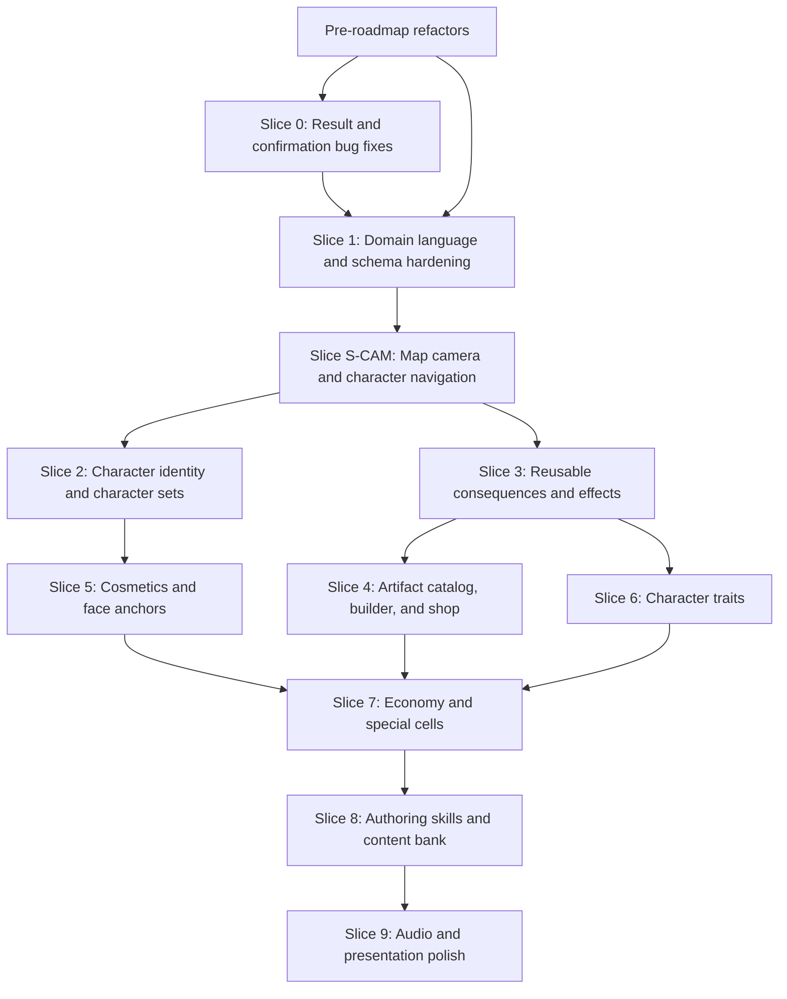

# Essence Roadmap

This roadmap turns the uploaded notes into buildable slices for the current Essence codebase. It treats the current implementation as the base: Socket.io room state, server-authoritative board flow, local minigame engines, event normalization, a map builder, and an event builder.

The plan is a working draft. The artifact language decision is resolved: **Artifact** means gameplay item, while current decorative `MapArtifact` objects are **Map Props** in product/UI language.

Progress is tracked directly in this file. When an implementation agent finishes a task, it should update the checkbox, add verification notes, and leave the next unblocked task obvious.

## Current Baseline

- Multiplayer board game for one friend group, with in-memory **Rooms** and server-authoritative **GameState** in `server/src/room.ts`.
- Shared contract in `shared/types.ts` for board cells, maps, minigames, events, actions, results, reveal payloads, and socket events.
- `shared/content.json` currently has 7 player slots, 17 minigames, 3 dares, 2 fates, a 54-cell active map, 56 routes, 9 terraces, 76 decorative map objects, and 24 map assets.
- The server already resolves activity results through `server/src/minigames/index.ts`, applies rigging, awards coins, applies event outcomes, and emits reveal screens.
- `client/src/components/MinigameBuilder.tsx` already edits story, activity type, content JSON, triggers, playtest players, and immediate consequences.
- `client/src/components/MapBuilder.tsx` already edits maps, cells, routes, terrain, decorative map props, event assignments, and import/export JSON.

## Roadmap Principles

- Extend the existing **Event -> Activity -> Result -> Reveal -> Consequence** path before adding parallel systems.
- Keep shared game rules in `shared/` and server resolution in `server/`; clients should present and submit input, not decide authoritative state.
- Make content portable through `Content JSON` import/export before introducing heavier persistence.
- Separate decorative board props from gameplay artifacts to avoid a long-term naming trap.
- Build in vertical slices that can be playtested with the current game after each slice.
- Every feature slice must include a reachable UI surface, a manual test path, and programmable content/configuration.
- Refactors discovered during domain review should be done before feature slices if later slices would otherwise build on the wrong concept.

## How To Use This Roadmap With AI

Use this prompt shape when asking an agent to continue:

```text
Read ROADMAP.md and UBIQUITOUS_LANGUAGE.md. Implement Slice <id> from start to finish.
Respect dependencies, update completed checkboxes in ROADMAP.md, add verification notes,
run relevant tests, and stop with the next unblocked task clearly identified.
```

Useful skills:

- `$implement`: best default for "implement Slice 0" or "implement S4-Artifact-Shop".
- `$tdd`: best for Slice 0 bugs and reusable rule-engine behavior where regression tests should lead.
- `$diagnosing-bugs`: best when a slice exposes a hard state, socket, or gameplay lifecycle bug.
- `$request-refactor-plan`: best before doing the pre-roadmap refactors if they need tiny commits and explicit sequencing.
- `$code-review`: best after a completed slice to catch regressions and missing tests.
- `$wayfinder`: best if this roadmap grows too large for one thread and needs investigation tickets.
- `$to-issues`: best if these slices should become GitHub/Linear issues.
- `$ubiquitous-language`: use whenever a domain term changes.

Codex goals can also work well for this project. A good goal is concrete and bounded, for example: "Implement Slice 0 from ROADMAP.md, update roadmap checkboxes, and leave all relevant tests passing." For large slices, create one goal per slice or per vertical sub-slice, not for the whole roadmap at once.

## Universal Slice Requirements

Every slice must leave the project in a state that can be inspected by a human.

- UI: any new user-facing feature must have a route, visible in-game entry point, or builder link.
- Navigation: builder UIs must be reachable from an obvious tools surface, not only by remembering a URL.
- Accessibility: new controls should be usable with pointer and keyboard, and should have labels/tooltips where icon-only controls appear.
- Configuration: artifacts, characters, cosmetics, effects, events, and maps must be editable through data and not hardcoded into one component.
- Import/export: builder-owned content must be downloadable and importable as JSON.
- Programmability: each configurable feature must have typed shared contracts and at least one example content definition.
- Reuse: effects, consequences, targeting, confirmation, and reveal formatting should be shared across minigames, events, artifacts, and traits.
- Verification: each slice must include automated tests where rules can regress and a short manual QA path for UI behavior.

## UI Access Plan

| Surface | Status | Route or entry point | Purpose |
| --- | --- | --- | --- |
| Game | Existing | `/` | Join/create room and play the current board game. |
| Board Camera Controls | Existing | In-game board HUD | Click player tokens, focus characters, and toggle a full-map overview. |
| Map Builder | Existing | `/map-builder` | Edit maps, board cells, routes, terrain, and map props. |
| Event Builder | Existing, with legacy component/file names | `/event-builder` (`/minigame-builder` legacy alias) | Edit events, activities, stories, and consequences. |
| Tools Hub | Existing | `/tools` | Link to every builder and validator so UIs are discoverable. |
| Character Builder | Existing | `/character-builder` | Edit characters, face photos, anchors, sets, and traits. |
| Artifact Builder | Planned | `/artifact-builder` | Edit artifact rules, rarity, effects, visuals, animations, and shop simulation. |
| Cosmetic Builder | Planned | `/cosmetic-builder` | Edit visual-only items and anchor placement. |
| Shop UI | Planned | In-game button beside roll button and shop-cell flow | Buy/equip cosmetics and roll/buy/use artifacts. |

## Progress Tracker

Legend: `[ ]` not started, `[x]` complete. If a task is blocked, keep it unchecked and add a short "Blocked:" note under the slice.

| Slice | Status | Depends on | Verification |
| --- | --- | --- | --- |
| `R-REF` Pre-roadmap refactors | [x] | None | `npm run test -w server`; `npm run typecheck -w server`; `npx tsc -p client/tsconfig.json --noEmit`; `npm run test -w client`; `npm run build -w client`; `git diff --check`. |
| `S0` Result and confirmation fixes | [x] | `R-REF` | `npm run test -w server`; `npm run typecheck -w server`; `npx tsc -p client/tsconfig.json --noEmit`; `npm run test -w client`; `npm run build -w client`; `git diff --check`. |
| `S1` Domain language and schema hardening | [x] | `R-REF` | `npm run test -w server`; `npm run typecheck -w server`; `npx tsc -p client/tsconfig.json --noEmit`; `npm run test -w client`; `npm run build -w client`; `git diff --check`. |
| `S-CAM` Map camera and character navigation | [x] | `S1` | `npm run test -w client`; `npx tsc -p client/tsconfig.json --noEmit`; `npm run build -w client`; Playwright board-camera QA; `git diff --check`. |
| `S2` Character identity and character sets | [x] | `S-CAM` | `npm run test -w server`; `npm run typecheck -w server`; `npm run test -w client`; `npx tsc -p client/tsconfig.json --noEmit`; `npm run build -w client`; Playwright character flow QA; `git diff --check`. |
| `S3` Reusable consequences and effects | [x] | `S1`, `S-CAM` | `npm run test -w server`; `npm run typecheck -w server`; `npm run test -w client`; `npx tsc -p client/tsconfig.json --noEmit`; `npm run build -w client`; Playwright Event Builder QA; `git diff --check`. |
| `S4` Artifact catalog, builder, and shop | [ ] | `S3`, `S-CAM` | Artifact builder route plus in-game shop purchase/use flow. |
| `S5` Cosmetics and face anchors | [ ] | `S2` | Cosmetic builder route plus anchored preview on multiple characters. |
| `S6` Character traits | [ ] | `S2`, `S3` | Character builder trait config plus live trait trigger. |
| `S7` Economy and special cells | [ ] | `S3`, `S4`, `S5`, `S6` | Coin-source tests plus in-game spending flow. |
| `S8` Authoring skills and content bank | [ ] | `S7` | Docs/skills can add example content and validation passes. |
| `S9` Audio and presentation polish | [ ] | `S8` | Manual QA with mute/volume and event feedback checks. |

## Pre-Roadmap Refactors

These should happen before the feature slices so the roadmap does not build on concepts we already know are wrong.

Tasks:

- [x] `R-REF-01` Remove or migrate the deprecated star mechanic.
  - Remove **Star** from product/domain language.
  - Replacement final scoring rule: first player to reach the finish cell wins; coins are the secondary ranking/tie-breaker.
  - Convert existing `star` board cells in `shared/content.json` into configured events, coin cells, shops, or regular minigames.
  - Remove `Player.stars`, `EventAction` star actions, automatic star awards, star-based sorting, and star badges once content no longer uses them.
  - Former star-style board decals were renamed to decorative `spark` decals.
- [x] `R-REF-02` Rename decorative board "artifact" language to **Map Prop** in UI and docs before adding gameplay artifacts.
- [x] `R-REF-03` Rename or wrap `/minigame-builder` as the **Event Builder** so non-minigame activities are not hidden under the wrong name.
- [x] `R-REF-04` Add a `docs/refactors/` or roadmap note for any intentionally deferred code-level renames that would be risky to do immediately.
  - Deferred: code-level `MapArtifact`, `artifacts`, `artifactProjection`, builder action ids, and `data-artifact-*` names remain as legacy implementation names until `S1` schema hardening can add migration/import compatibility.
  - Deferred: `client/src/components/MinigameBuilder.tsx` remains the component filename while `/event-builder` is the primary route and `/minigame-builder` remains a legacy alias.

Verification notes:

- Added a server regression test for no `Player.stars` field and finish-first winner resolution with coins as secondary ranking.
- Migrated former `star` cells in `shared/content.json` to regular `minigame` cells preserving their existing `whack-amigos` activity.
- Added shared ranking helpers for progress/current standings and finished-game standings.
- Updated Map Builder visible copy and README docs to say **Map Props** for decorative board objects.
- Added `/event-builder` as the primary Event Builder route and kept `/minigame-builder` as a legacy alias.

Acceptance:

- No future feature slice depends on stars as a scoring resource.
- "Artifact" is free to mean gameplay item in product language.
- Builders and roadmap language match the glossary.

## Dependency Tree



## Slice 0 (`S0`): Result And Confirmation Fixes

Goal: fix the bugs that block trust in the current game loop before adding new systems.

Tasks:

- [x] `S0-01` Show reveal/results for every minigame and activity, including votes and prompts.
- [x] `S0-02` Show the score or meaningful payload each player produced in minigame results.
- [x] `S0-03` Show the correct answer in trivia/buzzer reveals.
- [x] `S0-04` Show how many points/hits each player made in Whack.
- [x] `S0-05` For prendas/prompts, require confirmation from the rest of the group or the relevant confirmer set.
- [x] `S0-06` Add voting support for prompt/input-style minigames where the group decides the outcome.
- [x] `S0-07` Standardize reveal payload formatting per activity type so UI does not need one-off branches.
- [x] `S0-08` Add regression tests around `resolveMinigame`, `RevealPayload.entries`, prompt confirmation, vote scoring, and buzzer/trivia flavor.

Verification notes:

- Added server regressions for standardized `RevealPayload.entries`, buzzer correct-answer details, Whack hit labels, vote scoring/voter payloads, and group-confirmed prompt lifecycle.
- Added `resultLabel` and `detailLabel` to reveal entries so clients render result payloads without one-off activity branches.
- Prompt activities now default to confirmation by the rest of the connected group, with configurable `confirmation.mode`/`playerIds`; forced closure still reaches reveal without applying prompt consequences while confirmation is incomplete.
- Activities can configure ranked `subjects` separately from submitting `participants`, enabling prompt/input-style vote flows in the Event Builder.
- Updated the shared reveal UI, 3D reveal overlay, and Event Builder playtest resolution to show result labels, details, coins, and consequences consistently.
- Manual QA path: in a normal room, land on a prompt/prenda and confirm from the other players; in `/event-builder`, choose an Acting player, switch Preview as to a confirmer, submit, then inspect the playtest resolution/results.
- Full verification passed: `npm run test -w server`; `npm run typecheck -w server`; `npx tsc -p client/tsconfig.json --noEmit`; `npm run test -w client`; `npm run build -w client` (existing Vite large chunk warning only); `git diff --check`.

Current code to reuse:

- `server/src/minigames/index.ts` for result formatting.
- `server/src/room.ts` for activity lifecycle and reveal transition.
- `client/src/components/Reveal.tsx` for shared result display.
- `client/src/minigames/Whack.tsx`, `Vote.tsx`, and `Buzzer` content for activity-specific payloads.

Acceptance:

- A forced or completed activity always reaches a reveal or event completion state.
- Each reveal tells players what happened, who did what, what score/payload mattered, and what coins/consequences were applied.
- The manual QA path is reachable from a normal room and from the Event Builder playtest surface.

## Slice 1 (`S1`): Domain Language And Schema Hardening

Goal: make the future item/effect work fit the current event system instead of splitting the codebase.

Tasks:

- [x] `S1-01` Confirm canonical domain terms in `UBIQUITOUS_LANGUAGE.md`.
- [x] `S1-02` Decide whether current `MapArtifact` should become domain-language **Map Prop** while **Artifact** means gameplay item.
- [x] `S1-03` Add a content schema module or validation helpers for `GameContent`, events, actions, maps, and future item catalogs.
- [x] `S1-04` Rename UI copy in the map builder from "Artefactos" to "Props" or "Map props" if the term decision is accepted.
- [x] `S1-05` Expand shared tests around event normalization, trigger matching, action targets, map validation, and builder export/import.
- [x] `S1-06` Document the stable rule: immediate state changes are **Consequences**; duration-based modifiers are **Effects**.
- [x] `S1-07` Add a `/tools` surface or equivalent navigation so every builder can be found from the app.

Suggested fields:

- `GameContent.events`: existing event catalog.
- `GameContent.assetCatalog`: current map prop assets.
- Future `GameContent.characters`, `characterSets`, `cosmetics`, `artifacts`, and `effects`.

Verification notes:

- Confirmed the glossary decision: **Map Prop** is the decorative map object; **Artifact** is reserved for future gameplay items.
- Added `shared/contentValidation.ts` with schema normalization and validation for `GameContent`, events, action targets, maps, map props, and future catalog shells.
- Migrated authored content to `mapProps` while preserving legacy `artifacts` as a normalized runtime/import mirror.
- Added regressions for `mapProps` import/export compatibility, missing event action targets, missing map route targets, missing map prop assets, event normalization, trigger matching, action target resolution, map validation, and builder export/import.
- Added `/tools` and linked it from the join screen, Map Builder, and Event Builder.
- Stable rule documented in `UBIQUITOUS_LANGUAGE.md`: immediate state changes are **Consequences**; duration-based modifiers are **Effects**.
- Manual QA path: open `/tools`, navigate to Map Builder and Event Builder, import/export Content JSON, and confirm map props remain visible in the 3D map preview.
- Full verification passed: `npm run test -w server`; `npm run typecheck -w server`; `npx tsc -p client/tsconfig.json --noEmit`; `npm run test -w client`; `npm run build -w client`; `git diff --check`.

Acceptance:

- The roadmap language, content fields, builders, and UI labels use one consistent vocabulary.
- New features have a clear place in `shared/types.ts` before implementation starts.
- Builder navigation is visible without memorizing routes.

## Slice S-CAM (`S-CAM`): Map Camera And Character Navigation

Goal: make the board inspectable before target selection, artifacts, effects, and richer character identity depend on it.

Tasks:

- [x] `S-CAM-01` Add stable click/hit targets to player tokens on the 3D board.
- [x] `S-CAM-02` Track a selected/focused player in client presentation state without changing server gameplay state.
- [x] `S-CAM-03` When a player token or player list entry is clicked, focus that character on the map and show enough context to identify them.
- [x] `S-CAM-04` Add a camera mode toggle for active-turn follow and full-map overview.
- [x] `S-CAM-05` In full-map overview, frame the whole board and keep every character/token visible enough to understand where everyone is.
- [x] `S-CAM-06` Keep map inspection constrained to overview and player focus; do not expose manual camera movement.
- [x] `S-CAM-07` Keep camera controls accessible with keyboard focus, descriptive labels/tooltips, and mobile-safe touch targets.
- [x] `S-CAM-08` Reuse the same board/player focus primitive later for artifact target selection, effect inspection, and trajectory highlighting.
- [x] `S-CAM-09` Add tests around pure camera/view helpers where possible and a manual QA checklist for the rendered 3D behavior.

Suggested abstractions:

- `CameraMode`: `followActivePlayer`, `overview`.
- `FocusedPlayerId`: client-only selection/focus state that can be set from token clicks, scoreboard clicks, or future target selectors.
- `CameraIntent`: a small presentation command such as focus player, frame full map, frame trajectory, or reset.
- Token hit targets should expose stable player ids so future target selectors can reuse them instead of adding a separate picking layer.

Current code to reuse:

- `client/src/components/Board3DShell.tsx` for the 3D board shell and HUD placement.
- `client/src/components/GameScene3D.tsx` for tokens, camera updates, and rendered board interactions.
- `client/src/board3d.ts` and `client/src/boardView.test.ts` for camera math, token positions, and testable view helpers.
- `client/src/gamePresentationMachine.ts` for presentation state boundaries around movement, reveal, and active-player focus.
- `client/src/components/Scoreboard.tsx` for a secondary click/focus entry point into the same selected-player behavior.

Verification notes:

- Added reusable camera/focus primitives in `client/src/board3d.ts`: `CameraMode`, `FocusedPlayerId`, `CameraIntent`, `BoardCameraState`, `applyCameraIntent`, and full-map overview framing.
- `Board3DShell` now accepts client-only camera state, exposes stable player token hit targets with player ids, highlights the focused token, and frames overview mode.
- `GameScene3D` owns the focused-player state without mutating server gameplay state, adds compact board HUD controls for active follow, overview, and reset-to-active-player, and lets score rows focus the same player primitive.
- `Scoreboard` accepts optional focused-player callbacks so future target selectors can reuse the player-list focus surface.
- Manual QA path: create a room, start the board, click a score row and a board token to focus the player, switch to overview, then reset to active-player follow.
- Verification passed: `npm run test -w client`; `npx tsc -p client/tsconfig.json --noEmit`; `npm run build -w client` (existing Vite large chunk warning only); Playwright board-camera QA through helper-managed server/client; `git diff --check`.

Acceptance:

- A player can click a character/token on the board and the camera focuses that character.
- A player can click/select a player from the visible game UI and see where that character is on the map.
- The overview mode frames the full map and makes every character location discoverable.
- Map inspection is available through player focus and full-map overview without exposing manual camera movement.
- Camera modes work during idle turns, movement, event/reveal overlays, and after turn changes without mutating server state.
- The implementation creates reusable hooks/helpers for future artifact target selection and effect inspection.

## Slice 2 (`S2`): Character Identity And Character Sets

Goal: turn fixed player definitions into reusable configurable characters.

Tasks:

- [x] `S2-01` Add `CharacterDef` with id, display name, color, groom flag, face photo reference, face anchors, default loadout, and default traits.
- [x] `S2-02` Add `CharacterSetDef` so room creation can choose which preloaded characters may join.
- [x] `S2-03` Update room creation to include a selected character set.
- [x] `S2-04` Update join logic so a player claims a character slot from the selected set.
- [x] `S2-05` Build a Character Builder for creating/editing characters.
- [x] `S2-06` Make the Character Builder reachable from `/character-builder` and the tools surface.
- [x] `S2-07` Support downloading and importing the character JSON.
- [x] `S2-08` Seed default characters from the current `content.players`.
- [x] `S2-09` Add migration compatibility so existing `players` content still works.

Face anchor fields:

- `leftEye`: x, y, angle.
- `rightEye`: x, y, angle.
- `mouth`: x, y, angle.
- Optional body anchors for chest, head, hands, and back.

Verification notes:

- Added shared character contracts and helpers for `CharacterDef`, `CharacterSetDef`, visible room character slots, and character set summaries.
- `normalizeContentSchema` now migrates legacy `players` into default `characters` and `characterSets`, while Zod-backed character validation checks anchors, set membership, default loadouts, and trait/cosmetic references.
- Seeded `shared/content.json` with explicit default characters, face/body anchors, empty loadouts, empty traits, and the `Despedida original` character set.
- Room creation accepts a selected character set; `/api/character-sets` and `/api/rooms` expose set/slot summaries; join/create flows claim a character slot and prevent duplicate connected claims.
- Added `/character-builder` with character editing, face/body anchor editing, set membership editing, local draft persistence, JSON import/export, and a `/tools` link.
- Manual QA path: open `/tools`, navigate to `/character-builder`, verify import/export JSON, create a room with `Despedida original`, join as another character slot, start the board, confirm tokens render, and confirm no free-camera control appears.
- Verification passed: `npm run test -w server`; `npm run typecheck -w server`; `npm run test -w client`; `npx tsc -p client/tsconfig.json --noEmit`; `npm run build -w client` (existing Vite large chunk warning only); Playwright character flow QA with screenshots at `/tmp/essence-s2-character-builder.png` and `/tmp/essence-s2-board.png`; `git diff --check`.

Acceptance:

- A host can create a room with a chosen character set.
- A character can be imported/exported, edited, joined, and rendered with existing board tokens.
- Character data can be changed through JSON and through the builder UI.

## Slice 3 (`S3`): Reusable Consequences And Effects

Goal: create one rule engine that can power minigames, prendas, artifacts, character traits, and special cells.

Tasks:

- [x] `S3-01` Promote current `EventAction` into a reusable action/consequence vocabulary.
- [x] `S3-02` Add target selectors needed by the notes: acting player, target player, nearest ahead, nearest behind, everyone, ranking winner/loser/range, and fixed player.
- [x] `S3-03` Add offline-action consequences such as "take a shot" as prompt/confirmation flows rather than hidden state changes.
- [x] `S3-04` Add duration-based `EffectDef` and live `EffectInstance`.
- [x] `S3-05` Add effect duration modes: uses, turns, rounds, until triggered, and whole game.
- [x] `S3-06` Add effect lifecycle hooks: before roll, after roll, before movement, after movement, on cell enter, on activity result, and on turn end.
- [x] `S3-07` Add effect modifiers for movement multipliers, dice bias, half movement compatibility, skip turn, extra turn, conditional consequences, coin changes, position changes, swap positions, and move-to-nearest.
- [x] `S3-08` Add server-side application and expiration, with notifications when an effect ends.
- [x] `S3-09` Show active effects in the player position/score list with hover/tap detail and remaining duration.
- [x] `S3-10` Add builder controls for common consequences and effects, keeping advanced JSON escape hatches.

Acceptance:

- The current minigame consequence builder can express immediate rewards/punishments and user-attached duration effects.
- A duration effect like "for 2 rounds, move half of the die roll" can be configured and playtested.
- One-use effects such as "gain coins at turn end" and modifiers such as dice bias can be attached to shell targets like winner/loser/acting player.
- Effects can be configured in JSON and previewed through a builder/test surface.

Verification notes:

- Added `TargetSelector`/`ConsequenceDef` as the canonical shared vocabulary while keeping `EventActionTarget`/`EventAction` as compatibility aliases for existing event content.
- Added shared target resolution for acting player, selected target, nearest ahead/behind, everyone, ranking winner/loser/range, and fixed player selectors.
- Added reusable effect contracts: duration state, live `EffectInstance`, lifecycle hooks, one-use duration, and composed consequences for movement multipliers, dice bias, half movement compatibility, skip/extra turn, coin/move/move-to changes, swapping positions, and moving to the nearest player.
- Seeded `shared/content.json` with `half-roll-2-rounds`, a 2-round movement-multiplier effect that halves movement without bundling shot/offline-event behavior into the effect.
- Server now attaches duration-based consequence actions to resolved users, applies `applyEffect` consequences, runs effect lifecycle hooks during roll/movement/cell/activity/turn flow, expires use/turn/round/until-triggered effects, and emits `effect:ended`.
- Active effects appear in the legacy score list and the 3D HUD score panel with names, remaining duration, and hover/tap detail text.
- Event Builder now exposes common target selectors, multiple actions per consequence branch, inline attached-action timing, saved-effect composition, and the existing Content JSON import/export escape hatch.
- Regression coverage: server tests for saved-effect application, generic movement multiplier, one-use attached consequences, dice bias, duration ticking, and end notification; shared/client tests for target selectors, duration labels, invalid effect references, and legacy modifier-to-consequence migration.
- Full verification passed: `npm run test -w server`; `npm run typecheck -w server`; `npm run test -w client`; `npx tsc -p client/tsconfig.json --noEmit`; `npm run build -w client` (existing Vite large chunk warning only); Playwright Event Builder QA with screenshot at `/tmp/essence-s3-generic-effects.png`; `git diff --check`.

Manual validation checklist:

- [ ] Open `/event-builder`, add a consequence, and verify one branch can contain multiple action/effect rows.
- [ ] In `/event-builder`, choose target selectors for acting player, selected target, nearest ahead/behind, fixed player, winner/loser, and rank/range; verify the summary text stays readable.
- [ ] In `/event-builder`, set an action's Timing to `Attach to user`, change Runs/Duration/Count, and verify the Advanced JSON shows `hook` and `duration`.
- [ ] In `/event-builder`, choose `Saved effect`, compose movement multiplier plus dice bias or another timed consequence, then export/re-import Content JSON and verify it persists.
- [ ] In a room with content that applies `half-roll-2-rounds`, trigger the effect and verify the target's score row shows the active effect with remaining duration.
- [ ] While the effect is active, roll and verify movement is halved without any take-shot prompt appearing from the effect itself.
- [ ] Advance turns/rounds until expiration and verify the active effect disappears from the score UI.
- [ ] Use the board focus controls and full-map overview only; verify no manual/free camera movement controls appear.

## Slice 4 (`S4`): Artifact Catalog, Builder, And Shop

Goal: implement gameplay items that are bought, used immediately, and can apply consequences/effects.

Tasks:

- [ ] `S4-01` Add `ArtifactDef` with id, name, description, price, rarity, target mode, use flow, immediate consequences, duration effects, optional visuals, and optional animations.
- [ ] `S4-02` Add rarity buckets: common, epic, legendary.
- [ ] `S4-03` Add global rarity rates and artifact-specific weight overrides.
- [ ] `S4-04` Build Artifact Builder UI for listing, editing, previewing, and simulating shop rolls.
- [ ] `S4-05` Make the Artifact Builder reachable from `/artifact-builder` and the tools surface.
- [ ] `S4-06` Add shop cell support to map/content.
- [ ] `S4-07` Add shop UI button beside the roll button.
- [ ] `S4-08` Implement artifact shop visit flow:
  - First shop visit starts empty or prompts a roll, depending on final decision.
  - Roll produces four artifact offers.
  - Player can inspect what each artifact does.
  - Player can buy only one artifact per shop visit.
  - Coins are deducted immediately.
  - Purchase closes the shop and starts the artifact use flow.
- [ ] `S4-09` Implement target selection UI:
  - List all players with positions and active effects.
  - Hover/focus highlights target on board by reusing `S-CAM` focused-player primitives.
  - Show trajectory from acting player to target.
  - Center camera on that trajectory with the reusable camera intent model.
- [ ] `S4-10` Add optional outgoing/incoming animations for artifact use.
- [ ] `S4-11` Add shared announcement and confirmation flow after artifact use.
- [ ] `S4-12` Implement the first complete artifact: Mochila de Gaston.

Mochila de Gaston seed:

- Price and rarity to be decided.
- Incoming animation: Gaston delivers a backpack.
- Visual: backpack between the target character's arms, in front of chest.
- Effect: target advances half of die roll movement.
- Conditional consequence: if target rolls 6, target takes a shot.
- Duration: 2 rounds.

Acceptance:

- A player can land on a shop, roll offers, buy one affordable artifact, choose a target when needed, see the use announcement, and see the effect apply across turns.
- Artifacts can be modified through JSON and through the Artifact Builder without code edits.

## Slice 5 (`S5`): Cosmetics And Face Anchors

Goal: support visual-only purchases and character attachment positioning.

Tasks:

- [ ] `S5-01` Add `CosmeticDef` with id, name, price, asset, anchor type, transform, compatibility, and preview metadata.
- [ ] `S5-02` Add cosmetic ownership/equipped loadout to player or character state.
- [ ] `S5-03` Build Cosmetic Builder for previewing and adjusting visuals per character.
- [ ] `S5-04` Make the Cosmetic Builder reachable from `/cosmetic-builder` and the tools surface.
- [ ] `S5-05` Use face anchors to place glasses, moustaches, hats, beards, and similar face cosmetics.
- [ ] `S5-06` Support flexible object positioning relative to eyes, mouth, head, chest, arms, or custom anchors.
- [ ] `S5-07` Add cosmetic shop UI as a separate tab from artifacts.
- [ ] `S5-08` Allow players to buy any affordable cosmetics and select which ones are equipped.
- [ ] `S5-09` Guarantee cosmetics have no gameplay effect.

Acceptance:

- A face photo with anchors can correctly position at least glasses and moustache across multiple characters.
- Cosmetic purchases persist for the current game/session and do not affect rules.
- Cosmetics can be modified through JSON and through the Cosmetic Builder without code edits.

## Slice 6 (`S6`): Character Traits

Goal: let characters start with default positive or negative effects.

Tasks:

- [ ] `S6-01` Add character-attached `CharacterTrait` definitions that reuse the effect engine.
- [ ] `S6-02` Allow traits to be permanent, whole-game, or duration-limited.
- [ ] `S6-03` Show trait title and description in character selection and active effects UI.
- [ ] `S6-04` Add Character Builder controls for adding/removing traits.
- [ ] `S6-05` Implement the seed traits from the notes.

Seed traits:

- Javi: if he advances fewer than 5 spaces across two turns, he implodes and moves backward.
- Facu: the game changes language for one turn because he "does not know the language."
- Nico: if he rolls more than 4 twice in a row, he complains too little about luck and moves back 5 spaces.
- Willy: if he rolls 4 or more twice in a row, he loses a turn because he went to the countryside with his girlfriend.
- Beltran: in a "Belgrano at 4pm" zone, he moves back 3 spaces out of fear of being robbed.
- Frang: if he rolls 4 or more, he gets a simple finance/math challenge and moves back 1 space if he fails.

Acceptance:

- At least one always-on trait, one conditional trait, and one prompt/challenge trait work through the same effect engine.
- Traits can be edited from character JSON and the Character Builder.

## Slice 7 (`S7`): Economy And Special Cells

Goal: make coin sources and spending feel coherent.

Tasks:

- [ ] `S7-01` Define all coin sources: shots/offline prompts, minigames, communist-style artifact, coin cells, steal-coin artifacts.
- [ ] `S7-02` Add coin special cells to map/content.
- [ ] `S7-03` Add reusable consequences for gaining, losing, stealing, and redistributing coins.
- [ ] `S7-04` Add guardrails so players cannot spend below zero.
- [ ] `S7-05` Show why coins changed in reveal/event/action logs.
- [ ] `S7-06` Balance artifact and cosmetic prices against minigame payouts.

Acceptance:

- A player can earn coins from at least two non-minigame sources and spend them in shop flows without state inconsistencies.

## Slice 8 (`S8`): Authoring Skills And Content Bank

Goal: make future content creation repeatable without code spelunking.

Tasks:

- [ ] `S8-01` Add repo-local skills/docs for:
  - Modifying the map.
  - Adding events.
  - Adding minigames.
  - Adding artifacts.
  - Adding cosmetics.
  - Adding story beats.
  - Running the PR workflow.
- [ ] `S8-02` Add examples for a basic event, a scored minigame, an artifact with immediate consequence, an artifact with duration effect, a cosmetic, and a character trait.
- [ ] `S8-03` Add validation scripts for content JSON, artifact rates, missing assets, invalid anchors, and unreachable map cells.
- [ ] `S8-04` Convert the anecdote list into tagged `StoryBeat` content.

Story/anecdote content bank from notes:

- Bomba de cloro.
- Bolidora de caca.
- Petardos por la ventana.
- Beltran atado en UPD.
- Faltaron al examen de biologia.
- Vinchuca y Chagas.
- Palazo en los huevos a Javi.
- Frang y Gaston yendo al bano de la mano.
- Portazo de Gaston en Bariloche.
- Gaston rompio el vidrio.
- Palo de hockey rompiendo vidrio, Javi y Willy.
- Pelotazo a Martina.
- Martina llorando porque Nico le dio un abrazo.
- Durmiendo a la intemperie: Marco Clopet diciendo "tengo frio".
- Willy encerrado en el armario durante clase de Alan.
- Gritarle a Jony y esconderse abajo de la ventana.
- Esconderse en los lockers de Jony.
- Palazo en los huevos de Anna.
- Javi discutiendo con Ana de historia, momento incomodo.
- La lengua loca de padornmania extrema.
- Caldo en el taxi, bajar a dar ropa a Gaston.
- Jugar al Just Dance en el Kinect del atico de Martinez.
- Orgia en el campo.
- Subir el tronco al aula.
- Tirar sillas en el aula.
- Cuando rompieron el vidrio por jugar a tirar el palo de hockey.
- Regalarme el coso amarillo de la ciudad todo meado.
- Cuando rompimos el arbol.
- Cuando nos acusaron de robar cosas del quiosco de los mas chicos.

Acceptance:

- A non-core developer can add a new event, artifact, cosmetic, or story beat by following docs and running validation.

## Slice 9 (`S9`): Audio And Presentation Polish

Goal: make feedback legible and fun once the systems are stable.

Tasks:

- [ ] `S9-01` Add sound effect infrastructure with mute/volume controls.
- [ ] `S9-02` Add Discord-style UI sounds.
- [ ] `S9-03` Add coin sounds.
- [ ] `S9-04` Add event entry sounds.
- [ ] `S9-05` Add artifact sounds.
- [ ] `S9-06` Add event-specific sounds.
- [ ] `S9-07` Add notifications for effect applied, effect ticked, effect ended, artifact used, and purchase completed.
- [ ] `S9-08` Tune reveal, target selector, shop, and active effect presentation for desktop and mobile.

Acceptance:

- Important state changes have visible and optional audible feedback without blocking gameplay.

## Bug Backlog

These are captured from the notes and should be handled in Slice 0 unless a task depends on later systems.

| Bug | Roadmap slice | Notes |
| --- | --- | --- |
| Show minigame results | Slice 0 | Current reveal exists, but payload/detail coverage needs to be reliable for all engines. |
| Show points each player made in minigames | Slice 0 | Add per-engine flavor/score formatting. |
| Show correct result in trivias | Slice 0 | Buzzer/trivia reveal should show correct answer, not just rank. |
| Show Whack points per player | Slice 0 | Whack payload already submits `hits`; reveal must expose it clearly. |
| In prendas, the rest confirms it was done | Slice 0 | Needs confirmation model, likely reusable for offline artifact consequences. |
| Add voting in input minigame | Slice 0 | Likely `prompt` plus `vote`/`hostPick` resolver or a combined activity flow. |

## Feature Backlog By Domain

### Map Navigation

- Clickable character/player tokens on the 3D board.
- Scoreboard or player-list entries that can focus a character on the map.
- Active-turn follow camera.
- Full-map overview mode that shows where all characters are.
- Full-map overview toggle for map inspection.
- Reset control back to the active player/current turn.
- Reusable focused-player and camera-intent helpers for target selection, effects, and artifact flows.

### Characters

- Character Builder.
- Face photos.
- Face anchors for eyes and mouth, including position and angle.
- Default preloaded characters.
- Character JSON download/import/edit.
- Room creation with selectable character set.
- Character traits/default effects.

### Cosmetics

- Cosmetic catalog.
- Cosmetic shop tab.
- Buy and equip cosmetics.
- Cosmetic positioning relative to face/body anchors.
- Preview cosmetics per character in builder.
- Visual-only guarantee.

### Artifacts

- Artifact catalog.
- Artifact builder.
- Price, rarity, duration, use mode, target mode, consequences, effects, visuals, animations.
- Rarity rates and shop roll simulation.
- Shop roll with four offers.
- One artifact purchase per shop visit.
- Immediate artifact use after purchase.
- Target selection, board highlight, trajectory, and camera centering built on `S-CAM`.
- Active artifact/effect list in player positions.
- Hover/tap remaining duration.
- Effect-end notifications.
- Shared message and ready/confirmation after artifact use.
- Reusable consequence/effect logic shared with minigames.

### Economy

- Extra coins from shots/offline prompts.
- Extra coins from minigames.
- Extra coins from special coin cells.
- Steal/redistribute coin artifacts.
- Communist-style artifact that steals from everyone and gives to the acting player.

### Authoring

- Skills/docs for maps, events, minigames, artifacts, cosmetics, story, and PR workflow.
- Validation for content and catalogs.
- Story beat tagging and reuse.

### Presentation

- Sound effects.
- Discord-style UI sounds.
- Coin and event sounds.
- Artifact sounds and animations.
- Effect notifications.

## Source Notes Coverage

This table maps the uploaded notes to roadmap slices. If a new note appears, add a row here before changing implementation tasks.

| Source note area | Covered by | Notes |
| --- | --- | --- |
| Show minigame results | `S0` | Includes reveal reliability for all activity types. |
| Show per-player minigame points/results | `S0` | Uses **Activity Score** and payload formatting. |
| Show correct trivia answer | `S0` | Buzzer/trivia reveal formatting. |
| Show Whack points per player | `S0` | Whack payload already submits hits; reveal needs to expose it. |
| Group confirmation for prendas | `S0`, `S3` | Starts as bug fix, becomes reusable confirmation consequence. |
| Voting in input minigame | `S0`, `S3` | Likely combined prompt/vote activity or configurable resolver chain. |
| Better characters and character builder | `S2` | Includes defaults, room character sets, JSON import/export. |
| Face photo, eyes, mouth, anchor angle | `S2`, `S5` | Character anchors power cosmetics and visuals. |
| Default preloaded players/characters | `S2` | Migrates current `content.players`. |
| Click characters, find them on the map, full-map overview | `S-CAM` | Adds board inspection before artifacts, effects, and richer character flows depend on it. |
| Cosmetic system | `S5` | Visual-only, buy/equip, anchored previews. |
| Artifact system | `S3`, `S4` | Reuses consequences/effects and adds catalog/shop/use flows. |
| Artifact builder, rarity, rates, shop simulation | `S4` | Artifact Builder must expose these as UI and JSON. |
| Artifact target selection, highlight, trajectory, camera centering | `S-CAM`, `S4` | `S-CAM` provides focus/camera primitives; `S4` adds artifact-specific target flow. |
| Artifact outgoing/incoming animations | `S4`, `S9` | Rule flow first, polish later. |
| Artifact duration effects and expiration notifications | `S3`, `S4`, `S9` | Engine first, item integration second, polish last. |
| Reusable consequence/effect logic | `S3` | Explicitly shared by minigames, events, artifacts, traits, and cells. |
| Offline shot consequences | `S0`, `S3`, `S7` | Confirmation and optional coin reward policy. |
| Character default buffs/effects | `S6` | Named **Character Traits** in glossary. |
| Extra coins from shots/minigames/special cells/artifacts | `S7` | Economy balancing and reusable coin consequences. |
| Authoring skills for map/events/minigames/artifacts/cosmetics/story/PRs | `S8` | Repo-local skills/docs plus validation examples. |
| Sound effects and Discord-style sounds | `S9` | Presentation polish after mechanics are stable. |
| Anecdote/history bank | `S8` | Converted into tagged **Story Beat** content. |
| Star removal | `R-REF` | New review feedback; remove before roadmap implementation. |

## Proposed Data Relationships

```ts
interface GameContent {
  players: PlayerDef[]; // legacy compatibility
  characters?: Record<string, CharacterDef>;
  characterSets?: Record<string, CharacterSetDef>;
  events?: Record<string, GameEventDef>;
  effects?: Record<string, EffectDef>;
  artifacts?: Record<string, ArtifactDef>;
  cosmetics?: Record<string, CosmeticDef>;
  assetCatalog?: MapAssetDef[]; // decorative map props
}

interface CharacterDef {
  id: string;
  name: string;
  color?: string;
  groom?: boolean;
  facePhoto?: ContentAssetRef;
  anchors?: CharacterAnchors;
  defaultCosmetics?: string[];
  traits?: CharacterTraitDef[];
}

interface ArtifactDef {
  id: string;
  name: string;
  description: string;
  price: number;
  rarity: "common" | "epic" | "legendary";
  targetMode: ArtifactTargetMode;
  consequences?: ConsequenceDef[];
  effects?: string[]; // compatibility; prefer reusable consequences/applyEffect rows
  visual?: ItemVisualDef;
  animations?: ArtifactAnimationDef;
}

interface EffectInstance {
  id: string;
  effectId: string;
  sourcePlayerId?: string;
  targetPlayerId: string;
  remaining: EffectDurationState;
  consequences: ConsequenceDef[];
  visual?: ItemVisualDef;
}
```

The exact names should be finalized after the glossary decision, but the relationship is important: artifacts, character traits, special cells, and minigame outcomes should all reuse the same consequence/effect vocabulary.

## Open Decisions

We should grill these one at a time before treating the roadmap as final.

1. Should artifact purchases always be used immediately, or can some artifacts be stored for later?
2. When a player lands on shop, should the first view be empty until reroll, or should four offers appear immediately?
3. Should cosmetic ownership persist only within a room, inside imported character JSON, or in a future account/profile store?
4. For future non-prompt offline actions, should confirmation reuse the prompt confirmer set exactly, or add consequence-specific confirmation rules?
5. Should character traits be visible to everyone before the game starts, or revealed only when triggered?
6. Should shots/offline prompts award coins automatically, only after confirmation, or never by default?
7. Should anecdotes be raw content titles only, or structured story beats with tags, safe display text, and allowed activity types?

Resolved:

- Win condition: first player to reach the finish cell wins; coins are the secondary ranking/tie-breaker.
- Artifact language: **Artifact** means gameplay item; current decorative map objects are **Map Props** in product/UI language.
- Prompt/prenda confirmation: defaults to the rest of the connected group and can be configured with `confirmation.mode` or `confirmation.playerIds`.
- Manual camera movement is intentionally out of scope; map inspection uses player focus plus full-map overview.
- Effect durations: `uses` tick when the effect actually fires, `turns` tick when the target player's turn ends, `rounds` tick when the room round advances, `untilTriggered` expires on a matching trigger, and `game` lasts until the game ends.
- Effect authoring: effects are user-attached duration-wrapped compositions of the same consequence vocabulary; shot/offline prompts should be modeled as events or immediate consequences, not bundled into the seeded movement effect.

## Next Review Step

Start with `S4` Artifact Catalog, Builder, And Shop. `R-REF`, `S0`, `S1`, `S-CAM`, `S2`, and `S3` are complete, so the next dependency unlock is gameplay artifacts that reuse the shared consequence/effect engine.
