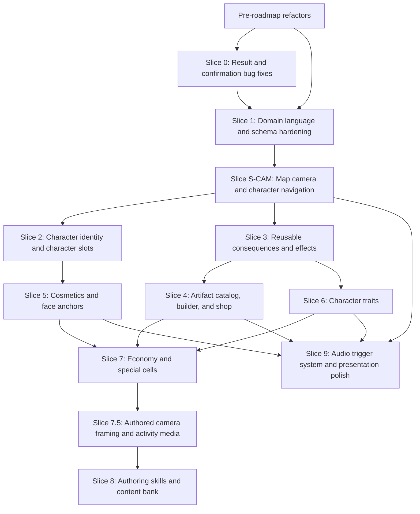

# Essence Roadmap

This roadmap turns the uploaded notes into buildable slices for the current Essence codebase. It treats the current implementation as the base: Socket.io room state, server-authoritative board flow, local minigame engines, event normalization, a map builder, and an event builder.

The plan is a working draft. The artifact language decision is resolved: **Artifact** means gameplay item, while current decorative `MapArtifact` objects are **Map Props** in product/UI language.

Progress is tracked directly in this file. When an implementation agent finishes a task, it should update the checkbox, add verification notes, and leave the next unblocked task obvious.

## Current Baseline

- Multiplayer board game for one friend group, with in-memory **Rooms** and server-authoritative **GameState** in `server/src/room.ts`.
- Shared contract in `shared/types.ts` for board cells, maps, events, activities, actions, results, reveal payloads, and socket events.
- `shared/content.json` currently has 10 authored characters, 22 events, 2 effects, 6 gameplay artifacts, 22 visual cosmetics, 1 active 54-cell map, 56 routes, 9 terraces, 78 decorative map props, 81 map assets, and 2 shop cells.
- The server already resolves activity results through `server/src/activities/index.ts`, applies rigging, awards coins, applies event outcomes, and emits reveal screens.
- `client/src/components/EventBuilder.tsx` already edits story, activity type, content JSON, triggers, playtest players, and immediate consequences.
- `client/src/components/MapBuilder.tsx` already edits maps, cells, routes, terrain, decorative map props, event assignments, and import/export JSON.
- Builder Save buttons use the local Vite dev endpoint `/api/dev/content` to validate and write normalized `shared/content.json`, with browser draft storage as a fallback and Download as an explicit backup path.

## Roadmap Principles

- Extend the existing **Event -> Activity -> Result -> Reveal -> Consequence** path before adding parallel systems.
- Keep shared game rules in `shared/` and server resolution in `server/`; clients should present and submit input, not decide authoritative state.
- Make content portable through `Content JSON` import/export before introducing heavier persistence.
- Separate decorative board props from gameplay artifacts to avoid a long-term naming trap.
- Build in vertical slices that can be playtested with the current game after each slice.
- Every feature slice must include a reachable UI surface, a manual test path, and programmable content/configuration.
- Refactors discovered during domain review should be done before feature slices if later slices would otherwise build on the wrong concept.

## How To Use This Roadmap With AI

Use this prompt shape when asking an agent to continue:

```text
Read ROADMAP.md and UBIQUITOUS_LANGUAGE.md. Implement Slice <id> from start to finish.
Respect dependencies, update completed checkboxes in ROADMAP.md, add verification notes,
run relevant tests, and stop with the next unblocked task clearly identified.
```

Useful skills:

- `$implement`: best default for "implement Slice 0" or "implement S4-Artifact-Shop".
- `$tdd`: best for Slice 0 bugs and reusable rule-engine behavior where regression tests should lead.
- `$diagnosing-bugs`: best when a slice exposes a hard state, socket, or gameplay lifecycle bug.
- `$request-refactor-plan`: best before doing the pre-roadmap refactors if they need tiny commits and explicit sequencing.
- `$code-review`: best after a completed slice to catch regressions and missing tests.
- `$wayfinder`: best if this roadmap grows too large for one thread and needs investigation tickets.
- `$to-issues`: best if these slices should become GitHub/Linear issues.
- `$ubiquitous-language`: use whenever a domain term changes.

Codex goals can also work well for this project. A good goal is concrete and bounded, for example: "Implement Slice 0 from ROADMAP.md, update roadmap checkboxes, and leave all relevant tests passing." For large slices, create one goal per slice or per vertical sub-slice, not for the whole roadmap at once.

## Universal Slice Requirements

Every slice must leave the project in a state that can be inspected by a human.

- UI: any new user-facing feature must have a route, visible in-game entry point, or builder link.
- Navigation: builder UIs must be reachable from an obvious tools surface, not only by remembering a URL.
- Accessibility: new controls should be usable with pointer and keyboard, and should have labels/tooltips where icon-only controls appear.
- Configuration: artifacts, characters, cosmetics, effects, events, and maps must be editable through data and not hardcoded into one component.
- Import/export: builder-owned content must be downloadable and importable as JSON.
- Programmability: each configurable feature must have typed shared contracts and at least one example content definition.
- Reuse: effects, consequences, targeting, confirmation, and reveal formatting should be shared across minigames, events, artifacts, and traits.
- Verification: each slice must include automated tests where rules can regress and a short manual QA path for UI behavior.

## UI Access Plan

| Surface | Status | Route or entry point | Purpose |
| --- | --- | --- | --- |
| Game | Existing | `/` | Join/create room, choose an authored map, and play the current board game. |
| Board Camera Controls | Existing | In-game board HUD | Click player tokens, focus characters, and toggle a full-map overview. |
| Map Builder | Existing | `/map-builder` | Edit maps, board cells, routes, terrain, map props, and future authored camera framing; save to `shared/content.json`; inspect/search props in the 3D gallery. |
| Event Builder | Existing | `/event-builder` | Edit events, activities, stories, and consequences. |
| Tools Hub | Existing | `/tools` | Link to every builder and validator so UIs are discoverable. |
| Character Builder | Existing | `/character-builder` | Edit characters, face photos, anchors, default loadouts, and draft trait ids. |
| Artifact Builder | Existing | `/artifact-builder` | Edit artifact rules, rarity, effects, visuals, animations, and shop simulation. |
| Cosmetic Builder | Existing | `/cosmetic-builder` | Edit visual-only items, prices, anchor placement, transforms, compatibility, and previews. |
| Shop UI | Existing | In-game shop button and shop board cells | Buy/equip cosmetics; auto-open shared artifact shop visits on shop cells; roll, buy, target, and use gameplay artifacts. |

## Authoring Persistence And Map Builder Follow-up

These changes landed while validating the completed S4/S5 builder work and should be treated as part of the current baseline, not future roadmap scope.

- [x] Add Save actions that write validated normalized content to `shared/content.json` in local dev for Map Builder, Event Builder, Character Builder, Cosmetic Builder, and Artifact Builder.
- [x] Keep browser drafts as fallback/recovery only; Reset draft restores the latest saved browser draft or the current `content.json` baseline rather than acting as the authoritative save path.
- [x] Keep Download/Copy inside JSON import/export panels so header toolbars stay focused on editing actions.
- [x] Simplify Map Builder toolbar spacing with a shorter map selector, icon-only map actions, tooltips/ARIA labels, and no direct Game shortcut.
- [x] Add Map Builder delete-map action with guardrails so the last map cannot be removed.
- [x] Move the prop 3D viewer into the Props tool area, add prop search, and keep the separate full-map 3D preview available from the preview card instead of a header dropdown.
- [x] Let room creation choose any map saved in `shared/content.json`, with map stats shown before creating the room.

## Progress Tracker

Legend: `[ ]` not started, `[x]` complete. If a task is blocked, keep it unchecked and add a short "Blocked:" note under the slice.

| Slice | Status | Depends on | Verification |
| --- | --- | --- | --- |
| `R-REF` Pre-roadmap refactors | [x] | None | `npm run test -w server`; `npm run typecheck -w server`; `npx tsc -p client/tsconfig.json --noEmit`; `npm run test -w client`; `npm run build -w client`; `git diff --check`. |
| `S0` Result and confirmation fixes | [x] | `R-REF` | `npm run test -w server`; `npm run typecheck -w server`; `npx tsc -p client/tsconfig.json --noEmit`; `npm run test -w client`; `npm run build -w client`; `git diff --check`. |
| `S1` Domain language and schema hardening | [x] | `R-REF` | `npm run test -w server`; `npm run typecheck -w server`; `npx tsc -p client/tsconfig.json --noEmit`; `npm run test -w client`; `npm run build -w client`; `git diff --check`. |
| `S-CAM` Map camera and character navigation | [x] | `S1` | `npm run test -w client`; `npx tsc -p client/tsconfig.json --noEmit`; `npm run build -w client`; Playwright board-camera QA; `git diff --check`. |
| `S2` Character identity and character slots | [x] | `S-CAM` | `npm run test -w server`; `npm run typecheck -w server`; `npm run test -w client`; `npx tsc -p client/tsconfig.json --noEmit`; `npm run build -w client`; Playwright character flow QA; `git diff --check`. |
| `S3` Reusable consequences and effects | [x] | `S1`, `S-CAM` | `npm run test -w server`; `npm run typecheck -w server`; `npm run test -w client`; `npx tsc -p client/tsconfig.json --noEmit`; `npm run build -w client`; Playwright Event Builder QA; `git diff --check`. |
| `S4` Artifact catalog, builder, and shop | [x] | `S3`, `S-CAM` | `npm run test -w server`; `npm run typecheck -w server`; `npm run test -w client`; `npx tsc -p client/tsconfig.json --noEmit`; `npm run build`; Playwright S4 builder/shop QA; `git diff --check`. |
| `S5` Cosmetics and face anchors | [x] | `S2` | `npm run test -w server`; `npm run typecheck -w server`; `npm run test -w client`; `npx tsc -p client/tsconfig.json --noEmit`; `npm run build -w client`; Playwright S5 builder/shop QA; `git diff --check`. |
| `S6` Character traits | [x] | `S2`, `S3` | `npm run test -w server`; `npm run typecheck -w server`; `npm run test -w client`; `npx tsc -p client/tsconfig.json --noEmit`; `npm run build`; Playwright S6 builder/lobby QA; `git diff --check`. |
| `S7` Economy and special cells | [ ] | `S3`, `S4`, `S5`, `S6` | Economy consequence tests, minigame payout migration, builder UI QA, and shop/minigame spending flow. |
| `S7.5` Authored camera framing and activity media | [x] | `S7`, `S-CAM` | `npm run test -w client`; `npx tsc -p client/tsconfig.json --noEmit`; `npm run build -w client`; `npm run test -w server`; `npm run typecheck -w server`; Playwright Map Builder/Event Builder QA; `git diff --check`. |
| `S8` Authoring skills and content bank | [ ] | `S7.5` | Docs/skills can add example content, map-event coverage, generation helpers, and validation passes. |
| `S9` Audio trigger system and presentation polish | [ ] | `S-CAM`, `S4`, `S5`, `S6` | Sound Builder QA, runtime trigger QA, mute/volume checks, weighted variant tests, and browser autoplay checks. |

## Pre-Roadmap Refactors

These should happen before the feature slices so the roadmap does not build on concepts we already know are wrong.

Tasks:

- [x] `R-REF-01` Remove or migrate the deprecated star mechanic.
  - Remove **Star** from product/domain language.
  - Replacement final scoring rule: first player to reach the finish cell wins; coins are the secondary ranking/tie-breaker.
  - Convert existing `star` board cells in `shared/content.json` into configured events, coin cells, shops, or regular minigames.
  - Remove `Player.stars`, `EventAction` star actions, automatic star awards, star-based sorting, and star badges once content no longer uses them.
  - Former star-style board decals were renamed to decorative `spark` decals.
- [x] `R-REF-02` Rename decorative board "artifact" language to **Map Prop** in UI and docs before adding gameplay artifacts.
- [x] `R-REF-03` Rename or wrap `/minigame-builder` as the **Event Builder** so non-minigame activities are not hidden under the wrong name.
- [x] `R-REF-04` Add a `docs/refactors/` or roadmap note for any intentionally deferred code-level renames that would be risky to do immediately.
  - Deferred: code-level `MapArtifact`, `artifacts`, `artifactProjection`, builder action ids, and `data-artifact-*` names remain as legacy implementation names until `S1` schema hardening can add migration/import compatibility.

Verification notes:

- Added a server regression test for no `Player.stars` field and finish-first winner resolution with coins as secondary ranking.
- Migrated former `star` cells in `shared/content.json` to regular `minigame` cells preserving their existing `whack-amigos` activity.
- Added shared ranking helpers for progress/current standings and finished-game standings.
- Updated Map Builder visible copy and README docs to say **Map Props** for decorative board objects.
- Renamed the authoring module to `EventBuilder.tsx` and removed the former `/minigame-builder` route alias.

Acceptance:

- No future feature slice depends on stars as a scoring resource.
- "Artifact" is free to mean gameplay item in product language.
- Builders and roadmap language match the glossary.

## Dependency Tree



## Slice 0 (`S0`): Result And Confirmation Fixes

Goal: fix the bugs that block trust in the current game loop before adding new systems.

Tasks:

- [x] `S0-01` Show reveal/results for every minigame and activity, including votes and prompts.
- [x] `S0-02` Show the score or meaningful payload each player produced in minigame results.
- [x] `S0-03` Show the correct answer in trivia/buzzer reveals.
- [x] `S0-04` Show how many points/hits each player made in Whack.
- [x] `S0-05` For prendas/prompts, require confirmation from the rest of the group or the relevant confirmer set.
- [x] `S0-06` Add voting support for prompt/input-style minigames where the group decides the outcome.
- [x] `S0-07` Standardize reveal payload formatting per activity type so UI does not need one-off branches.
- [x] `S0-08` Add regression tests around `resolveActivityResults`, `RevealPayload.entries`, prompt confirmation, vote scoring, and buzzer/trivia flavor.

Verification notes:

- Added server regressions for standardized `RevealPayload.entries`, buzzer correct-answer details, Whack hit labels, vote scoring/voter payloads, and group-confirmed prompt lifecycle.
- Added `resultLabel` and `detailLabel` to reveal entries so clients render result payloads without one-off activity branches.
- Prompt activities now default to confirmation by the rest of the connected group, with configurable `confirmation.mode`/`playerIds`; forced closure still reaches reveal without applying prompt consequences while confirmation is incomplete.
- Activities can configure ranked `subjects` separately from submitting `participants`, enabling prompt/input-style vote flows in the Event Builder.
- Updated the shared reveal UI, 3D reveal overlay, and Event Builder playtest resolution to show result labels, details, coins, and consequences consistently.
- Manual QA path: in a normal room, land on a prompt/prenda and confirm from the other players; in `/event-builder`, choose an Acting player, switch Preview as to a confirmer, submit, then inspect the playtest resolution/results.
- Full verification passed: `npm run test -w server`; `npm run typecheck -w server`; `npx tsc -p client/tsconfig.json --noEmit`; `npm run test -w client`; `npm run build -w client` (existing Vite large chunk warning only); `git diff --check`.

Current code to reuse:

- `server/src/activities/index.ts` for result formatting.
- `server/src/room.ts` for activity lifecycle and reveal transition.
- `client/src/components/Reveal.tsx` for shared result display.
- `client/src/minigames/Whack.tsx`, `Vote.tsx`, and `Buzzer` content for activity-specific payloads.

Acceptance:

- A forced or completed activity always reaches a reveal or event completion state.
- Each reveal tells players what happened, who did what, what score/payload mattered, and what coins/consequences were applied.
- The manual QA path is reachable from a normal room and from the Event Builder playtest surface.

## Slice 1 (`S1`): Domain Language And Schema Hardening

Goal: make the future item/effect work fit the current event system instead of splitting the codebase.

Tasks:

- [x] `S1-01` Confirm canonical domain terms in `UBIQUITOUS_LANGUAGE.md`.
- [x] `S1-02` Decide whether current `MapArtifact` should become domain-language **Map Prop** while **Artifact** means gameplay item.
- [x] `S1-03` Add a content schema module or validation helpers for `GameContent`, events, actions, maps, and future item catalogs.
- [x] `S1-04` Rename UI copy in the map builder from "Artefactos" to "Props" or "Map props" if the term decision is accepted.
- [x] `S1-05` Expand shared tests around event normalization, trigger matching, action targets, map validation, and builder export/import.
- [x] `S1-06` Document the stable rule: immediate state changes are **Consequences**; duration-based modifiers are **Effects**.
- [x] `S1-07` Add a `/tools` surface or equivalent navigation so every builder can be found from the app.

Suggested fields:

- `GameContent.events`: existing event catalog.
- `GameContent.assetCatalog`: current map prop assets.
- `GameContent.characters`, `cosmetics`, `artifacts`, `effects`, and `maps`.

Verification notes:

- Confirmed the glossary decision: **Map Prop** is the decorative map object; **Artifact** is reserved for future gameplay items.
- Added `shared/contentValidation.ts` with schema normalization and validation for `GameContent`, events, action targets, maps, map props, and future catalog shells.
- Migrated authored content to `mapProps` while preserving legacy `artifacts` as a normalized runtime/import mirror.
- Added regressions for `mapProps` import/export compatibility, missing event action targets, missing map route targets, missing map prop assets, event normalization, trigger matching, action target resolution, map validation, and builder export/import.
- Added `/tools` and linked it from the join screen, Map Builder, and Event Builder.
- Stable rule documented in `UBIQUITOUS_LANGUAGE.md`: immediate state changes are **Consequences**; duration-based modifiers are **Effects**.
- Manual QA path: open `/tools`, navigate to Map Builder and Event Builder, import/export Content JSON, and confirm map props remain visible in the 3D map preview.
- Full verification passed: `npm run test -w server`; `npm run typecheck -w server`; `npx tsc -p client/tsconfig.json --noEmit`; `npm run test -w client`; `npm run build -w client`; `git diff --check`.

Acceptance:

- The roadmap language, content fields, builders, and UI labels use one consistent vocabulary.
- New features have a clear place in `shared/types.ts` before implementation starts.
- Builder navigation is visible without memorizing routes.

## Slice S-CAM (`S-CAM`): Map Camera And Character Navigation

Goal: make the board inspectable before target selection, artifacts, effects, and richer character identity depend on it.

Tasks:

- [x] `S-CAM-01` Add stable click/hit targets to player tokens on the 3D board.
- [x] `S-CAM-02` Track a selected/focused player in client presentation state without changing server gameplay state.
- [x] `S-CAM-03` When a player token or player list entry is clicked, focus that character on the map and show enough context to identify them.
- [x] `S-CAM-04` Add a camera mode toggle for active-turn follow and full-map overview.
- [x] `S-CAM-05` In full-map overview, frame the whole board and keep every character/token visible enough to understand where everyone is.
- [x] `S-CAM-06` Keep map inspection constrained to overview and player focus; do not expose manual camera movement.
- [x] `S-CAM-07` Keep camera controls accessible with keyboard focus, descriptive labels/tooltips, and mobile-safe touch targets.
- [x] `S-CAM-08` Reuse the same board/player focus primitive later for artifact target selection, effect inspection, and trajectory highlighting.
- [x] `S-CAM-09` Add tests around pure camera/view helpers where possible and a manual QA checklist for the rendered 3D behavior.

Suggested abstractions:

- `CameraMode`: `followActivePlayer`, `overview`.
- `FocusedPlayerId`: client-only selection/focus state that can be set from token clicks, scoreboard clicks, or future target selectors.
- `CameraIntent`: a small presentation command such as focus player, frame full map, frame trajectory, or reset.
- Token hit targets should expose stable player ids so future target selectors can reuse them instead of adding a separate picking layer.

Current code to reuse:

- `client/src/components/Board3DShell.tsx` for the 3D board shell and HUD placement.
- `client/src/components/GameScene3D.tsx` for tokens, camera updates, and rendered board interactions.
- `client/src/board3d.ts` and `client/src/boardView.test.ts` for camera math, token positions, and testable view helpers.
- `client/src/gamePresentationMachine.ts` for presentation state boundaries around movement, reveal, and active-player focus.
- `client/src/components/Scoreboard.tsx` for a secondary click/focus entry point into the same selected-player behavior.

Verification notes:

- Added reusable camera/focus primitives in `client/src/board3d.ts`: `CameraMode`, `FocusedPlayerId`, `CameraIntent`, `BoardCameraState`, `applyCameraIntent`, and full-map overview framing.
- `Board3DShell` now accepts client-only camera state, exposes stable player token hit targets with player ids, highlights the focused token, and frames overview mode.
- `GameScene3D` owns the focused-player state without mutating server gameplay state, adds compact board HUD controls for active follow, overview, and reset-to-active-player, and lets score rows focus the same player primitive.
- `Scoreboard` accepts optional focused-player callbacks so future target selectors can reuse the player-list focus surface.
- Manual QA path: create a room, start the board, click a score row and a board token to focus the player, switch to overview, then reset to active-player follow.
- Verification passed: `npm run test -w client`; `npx tsc -p client/tsconfig.json --noEmit`; `npm run build -w client` (existing Vite large chunk warning only); Playwright board-camera QA through helper-managed server/client; `git diff --check`.

Acceptance:

- A player can click a character/token on the board and the camera focuses that character.
- A player can click/select a player from the visible game UI and see where that character is on the map.
- The overview mode frames the full map and makes every character location discoverable.
- Map inspection is available through player focus and full-map overview without exposing manual camera movement.
- Camera modes work during idle turns, movement, event/reveal overlays, and after turn changes without mutating server state.
- The implementation creates reusable hooks/helpers for future artifact target selection and effect inspection.

## Slice 2 (`S2`): Character Identity And Character Slots

Goal: turn fixed player definitions into reusable configurable characters.

Tasks:

- [x] `S2-01` Add `CharacterDef` with id, display name, color, groom flag, face photo reference, face anchors, default loadout, and default traits.
- [x] `S2-02` Add a visible character-slot model so room creation and joining can choose authored characters.
- [x] `S2-03` Update room creation to include a selected character slot.
- [x] `S2-04` Update join logic so a player claims an available character slot.
- [x] `S2-05` Build a Character Builder for creating/editing characters.
- [x] `S2-06` Make the Character Builder reachable from `/character-builder` and the tools surface.
- [x] `S2-07` Support downloading and importing the character JSON.
- [x] `S2-08` Seed default characters from the current `content.players`.
- [x] `S2-09` Add migration compatibility so existing `players` content still works.

Face anchor fields:

- `leftEye`: x, y, angle.
- `rightEye`: x, y, angle.
- `mouth`: x, y, angle.
- Optional body anchors for chest, head, hands, and back.

Verification notes:

- Added shared character contracts and helpers for `CharacterDef` and visible room character slots.
- `normalizeContentSchema` now migrates legacy `players` into default `characters`, strips legacy `characterSets`, and validates anchors, default loadouts, and trait/cosmetic references.
- Seeded `shared/content.json` with explicit default characters, face/body anchors, empty loadouts, and empty trait ids.
- Room creation exposes character slots directly; join/create flows claim a character slot and prevent duplicate connected claims.
- Added `/character-builder` with character editing, face/body anchor editing, default loadout editing, local draft persistence, JSON import/export, and a `/tools` link.
- Manual QA path: open `/tools`, navigate to `/character-builder`, verify import/export JSON, create a room, join as another character slot, start the board, confirm tokens render, and confirm no free-camera control appears.
- Verification passed: `npm run test -w server`; `npm run typecheck -w server`; `npm run test -w client`; `npx tsc -p client/tsconfig.json --noEmit`; `npm run build -w client` (existing Vite large chunk warning only); Playwright character flow QA with screenshots at `/tmp/essence-s2-character-builder.png` and `/tmp/essence-s2-board.png`; `git diff --check`.

Acceptance:

- A host can create a room with a chosen character slot.
- A character can be imported/exported, edited, joined, and rendered with existing board tokens.
- Character data can be changed through JSON and through the builder UI.

## Slice 3 (`S3`): Reusable Consequences And Effects

Goal: create one rule engine that can power minigames, prendas, artifacts, character traits, and special cells.

Tasks:

- [x] `S3-01` Promote current `EventAction` into a reusable action/consequence vocabulary.
- [x] `S3-02` Add target selectors needed by the notes: acting player, target player, nearest ahead, nearest behind, everyone, ranking winner/loser/range, and fixed player.
- [x] `S3-03` Add offline-action consequences such as "take a shot" as prompt/confirmation flows rather than hidden state changes.
- [x] `S3-04` Add duration-based `EffectDef` and live `EffectInstance`.
- [x] `S3-05` Add effect duration modes: uses, turns, rounds, and whole game.
- [x] `S3-06` Add effect lifecycle hooks: before roll, after roll, before movement, after movement, on cell enter, on activity result, and on turn end.
- [x] `S3-07` Add effect modifiers for movement multipliers, dice bias, half movement compatibility, skip turn, extra turn, conditional consequences, coin changes, position changes, swap positions, and move-to-nearest.
- [x] `S3-08` Add server-side application and expiration, with notifications when an effect ends.
- [x] `S3-09` Show active effects in the player position/score list with hover/tap detail and remaining duration.
- [x] `S3-10` Add builder controls for common consequences and effects, keeping advanced JSON escape hatches.

Acceptance:

- The current minigame consequence builder can express immediate rewards/punishments and user-attached duration effects.
- A duration effect like "for 2 rounds, move half of the die roll" can be configured and playtested.
- One-use effects such as "gain coins at turn end" and modifiers such as dice bias can be attached to shell targets like winner/loser/acting player.
- Effects can be configured in JSON and previewed through a builder/test surface.

Verification notes:

- Added `TargetSelector`/`ConsequenceDef` as the canonical shared vocabulary while keeping `EventActionTarget`/`EventAction` as compatibility aliases for existing event content.
- Added shared target resolution for acting player, selected target, nearest ahead/behind, everyone, ranking winner/loser/range, and fixed player selectors.
- Added reusable effect contracts: duration state, live `EffectInstance`, lifecycle hooks, one-use duration, and composed consequences for movement multipliers, dice bias, half movement compatibility, skip/extra turn, coin/move/move-to changes, swapping positions, and moving to the nearest player.
- Seeded `shared/content.json` with `half-roll-2-rounds`, a 2-round movement-multiplier effect that halves movement without bundling shot/offline-event behavior into the effect.
- Server now attaches duration-based consequence actions to resolved users, applies `applyEffect` consequences, runs effect lifecycle hooks during roll/movement/cell/activity/turn flow, expires use/turn/round/until-triggered effects, and emits `effect:ended`.
- Active effects appear in the legacy score list and the 3D HUD score panel with names, remaining duration, and hover/tap detail text.
- Event Builder now exposes common target selectors, multiple actions per consequence branch, inline attached-action timing, an Effect builder for reusable effect types, named effect choices in the action type list, and the existing Content JSON import/export escape hatch.
- The live board now has a host-only development effect tool beside the map button in dev builds, with a `?debugTools` override for built static QA; it can attach server catalog effects and saved Event Builder draft effects to a selected player.
- Regression coverage: server tests for catalog effect application, generic movement multiplier, one-use attached consequences, dice bias, duration ticking, and end notification; shared/client tests for target selectors, duration labels, invalid effect references, and legacy modifier-to-consequence migration.
- Full verification passed: `npm run test -w server`; `npm run typecheck -w server`; `npm run test -w client`; `npx tsc -p client/tsconfig.json --noEmit`; `npm run build -w client` (existing Vite large chunk warning only); Playwright Event Builder QA with screenshot at `/tmp/essence-effect-builder.png`; Playwright live board dev-effect QA with screenshot at `/tmp/essence-debug-effects-tool.png`; `git diff --check`.

Manual validation checklist:

- [x] Open `/event-builder`, add a consequence, and verify one branch can contain multiple action/effect rows.
- [x] In `/event-builder`, choose target selectors for acting player, selected target, nearest ahead/behind, fixed player, winner/loser, and rank/range; verify the summary text stays readable.
- [x] In `/event-builder`, set an action's Timing to `Attach to user`, change Runs/Duration/Count, and verify the Advanced JSON shows `hook` and `duration`.
- [x] In `/event-builder`, create a new Effect builder entry, compose movement multiplier plus dice bias or another timed consequence, then verify the new effect appears by name in a consequence action's Type list.
- [x] Save, refresh, and verify the new effect type persists in the Effect builder and can still be selected from a consequence action.
- [x] As host in a live room, open the **Dev effects** tool beside the map button and verify built-in effects plus saved Event Builder draft effects appear in the Effect type list.
- [x] Apply an effect to a player from **Dev effects** and verify the score panel immediately shows that active effect with remaining duration.
- [x] In a room with content that applies `half-roll-2-rounds`, trigger the effect and verify the target's score row shows the active effect with remaining duration.
- [x] While the effect is active, roll and verify movement is halved without any take-shot prompt appearing from the effect itself.
- [x] Advance turns/rounds until expiration and verify the active effect disappears from the score UI.
- [x] Use the board focus controls and full-map overview only; verify no manual/free camera movement controls appear.

Manual QA completed by Facundo on 2026-07-07.

## Slice 4 (`S4`): Artifact Catalog, Builder, And Shop

Goal: implement gameplay items that are bought, used immediately, and can apply consequences/effects.

Tasks:

- [x] `S4-01` Add `ArtifactDef` with id, name, description, price, rarity, target mode, use flow, immediate consequences, duration effects, optional visuals, and optional animations.
- [x] `S4-02` Add rarity buckets: common, epic, legendary.
- [x] `S4-03` Add global rarity rates and artifact-specific weight overrides.
- [x] `S4-04` Build Artifact Builder UI for listing, editing, previewing, and simulating shop rolls.
- [x] `S4-05` Make the Artifact Builder reachable from `/artifact-builder` and the tools surface.
- [x] `S4-06` Add shop cell support to map/content.
- [x] `S4-07` Add shop UI button beside the roll button.
- [x] `S4-08` Implement artifact shop visit flow:
  - Shop visits auto-open a shared Artifacts view for every connected player when the active player reaches a shop cell.
  - First shop visit starts with a roll prompt for the shop actor.
  - Roll produces four artifact offers.
  - Player can inspect what each artifact does.
  - Player can buy only one artifact per shop visit.
  - Coins are deducted immediately.
  - Purchase either resolves an immediate artifact or pivots into the target/use flow in the same shared shop surface.
- [x] `S4-09` Implement target selection UI:
  - List all players with positions and active effects.
  - Hover/focus highlights target on board by reusing `S-CAM` focused-player primitives.
  - Show trajectory from acting player to target.
  - Center camera on that trajectory with the reusable camera intent model.
- [x] `S4-10` Add optional outgoing/incoming animations for artifact use.
- [x] `S4-11` Add shared announcement and confirmation flow after artifact use.
- [x] `S4-12` Implement the first complete artifact: Mochila de Gaston.

Mochila de Gaston seed:

- Price: 4 coins. Rarity: common.
- Incoming animation: `gaston-backpack-drop` metadata with shared announcement/camera presentation.
- Visual: backpack shown on the target character's front/chest while the active effect is live.
- Effect: target advances half of die roll movement.
- Conditional consequence: if target rolls 6, target takes a shot.
- Duration: 2 rounds.

Acceptance:

- A player can land on a shop, roll offers, buy one affordable artifact, choose a target when needed, see the use announcement, and see the effect apply across turns.
- Artifacts can be modified through JSON and through the Artifact Builder without code edits.

Verification notes:

- Added gameplay artifact contracts, rarity rates, target/use flow, shop offers, pending use state, and socket events without reusing decorative `MapArtifact`/Map Props.
- Added `shared/artifacts.ts` for rarity normalization, weighted unique shop rolls, pricing, target availability, and S3 consequence/effect conversion.
- Extended content validation for gameplay artifacts, artifact rarity rates, artifact visuals/animations/weight overrides, and the new `shop` tile type.
- Server room flow now starts an artifact shop from `shop` cells, rolls four offers, enforces one purchase per visit, deducts coins, resolves immediate or targeted artifact use, announces use through the event flow, and reuses S3 actions/effects.
- The shop UI keeps visual-only Cosmetics and gameplay Artifacts in separate tabs; Artifacts supports catalog inspection, offer rolling, purchase, target selection, target hover/focus, and use.
- Follow-up shop UX now auto-opens the same artifact shop state for all players, locks controls for spectators, shows the active shop actor and coins, displays the one-purchase-per-visit limit, hides spectator offer-card action buttons, and communicates rarity through card styling instead of extra badges.
- Target selection reuses S-CAM focus primitives, adds a board trajectory beam, and centers the camera on the acting-player-to-target path without reintroducing manual/free camera controls.
- Artifact use announcements identify both sender and receiver; the receiving player's event overlay headlines `Vos`, while other viewers see the receiver's name.
- Added `/artifact-builder` and Tools Hub access for catalog editing, rarity-rate editing, JSON import/export/download/save, validation, selected-artifact restore, compact browser draft fallback, and shop-roll simulation.
- Seeded `shared/content.json` with a shop tile, artifact rarity rates, four artifacts, and the first complete artifact, `mochila-de-gaston`, backed by the reusable `mochila-half-roll` effect.
- Mochila halves target movement for two rounds, renders a backpack gameplay visual on the target pawn while active, and triggers a take-shot offline action when the target's physical die face is 6.
- Follow-up effect notices show item consumed/expired messages when duration effects trigger or end; full S9 notification polish remains open.
- Verification passed: `npm run test -w server`; `npm run typecheck -w server`; `npm run test -w client`; `npx tsc -p client/tsconfig.json --noEmit`; `npm run build` (existing Vite large chunk warning only); content load smoke via `npx tsx`; Playwright S4 QA against dev server/client on `PORT=3002` and `CLIENT_PORT=5175`; screenshots at `/tmp/essence-s4-tools.png`, `/tmp/essence-s4-artifact-builder.png`, `/tmp/essence-s4-artifact-shop.png`, `/tmp/essence-s4-artifact-target.png`, and `/tmp/essence-s4-artifact-event.png`; follow-up two-client Playwright smoke for shared shop spectator state, hidden spectator CTAs, target headline `Vos`, and `/tmp/qa_artifact_reconnect_nico.png`; `git diff --check`.

Manual validation checklist:

- [x] Open `/tools` and verify Artifact Builder is reachable.
- [x] Open `/artifact-builder`, verify seeded artifacts validate, simulate a shop roll, and verify the catalog/export surface stays usable.
- [x] Start a live room, land on a shop cell, and verify the Artifacts tab opens with a roll prompt.
- [x] Roll artifact offers and verify four inspectable offers appear.
- [x] Buy one affordable artifact and verify a second purchase is blocked for the same shop visit.
- [x] Verify spectators see the same artifact shop state, cannot roll/buy/target, and do not see disabled offer-card action buttons.
- [x] Buy `Mochila de Gaston`, verify target selection appears, hover/focus a target, and verify board focus/trajectory presentation.
- [x] Use Mochila on a target and verify the shared event announcement names sender and receiver.
- [x] Verify the receiver's artifact-use event overlay headlines `Vos`; other viewers see the receiver's name.
- [x] Verify the target receives the backpack visual and the active effect.
- [x] Roll while Mochila is active and verify movement uses half of the physical die face.
- [x] Roll a physical 6 while Mochila is active and verify the take-shot offline action appears.
- [x] Use only board focus/overview primitives during target selection; verify no manual/free camera control returns.
- [x] Simulate storage pressure in Artifact Builder and verify compact draft persistence keeps the page usable without crashing.

Manual QA completed by Codex on 2026-07-07; follow-up shared-shop/browser persistence QA completed on 2026-07-08.

## Slice 5 (`S5`): Cosmetics And Face Anchors

Goal: support visual-only purchases and character attachment positioning.

Tasks:

- [x] `S5-01` Add `CosmeticDef` with id, name, price, asset, anchor type, transform, compatibility, and preview metadata.
- [x] `S5-02` Add cosmetic ownership/equipped loadout to player or character state.
- [x] `S5-03` Build Cosmetic Builder for previewing and adjusting visuals per character.
- [x] `S5-04` Make the Cosmetic Builder reachable from `/cosmetic-builder` and the tools surface.
- [x] `S5-05` Use face anchors to place glasses, moustaches, hats, beards, and similar face cosmetics.
- [x] `S5-06` Support flexible object positioning relative to eyes, mouth, head, chest, arms, or custom anchors.
- [x] `S5-07` Add cosmetic shop UI as a separate tab from artifacts.
- [x] `S5-08` Allow players to buy any affordable cosmetics and select which ones are equipped.
- [x] `S5-09` Guarantee cosmetics have no gameplay effect.

Verification notes:

- Expanded shared cosmetic contracts and Zod-backed content validation with legacy `characterCosmetics` normalization into `content.cosmetics`.
- Added `shared/cosmetics.ts` as the shared module for anchor inference, compatibility, pricing, ID normalization, and default visual semantics.
- Seeded configurable cosmetics for glasses, moustache, hat, beard, and chest tattoo/piercing-style body attachments with prices, anchors, transforms, and preview metadata.
- Room state now exposes `cosmetics`, `ownedCosmeticIds`, and equipped `cosmeticIds`; default character loadouts start owned/equipped, and socket actions buy/equip cosmetics for the current room/session.
- Added `/cosmetic-builder` with catalog editing, anchor/transform controls, compatibility controls, JSON import/export, and preview across multiple characters.
- Follow-up Cosmetic Builder QA added ordered `anchors[]` support for two-anchor cosmetics such as goggles, an anchor visibility toggle, and anchor-relative placement labels.
- Updated Character Builder previews/default loadouts to render from the shared cosmetic catalog.
- Removed Character Builder's duplicated accessory catalog/editor surface so cosmetics are authored from the shared catalog in Cosmetic Builder.
- Removed the character set authoring/runtime path; saved `content.characters` is now the single character list used by the builder, room creation, and room slots, while legacy `characterSets` imports are stripped during normalization.
- Updated 3D token rendering so cosmetics are data-driven and anchored to face/body anchors without affecting movement, events, minigames, artifacts, effects, scoring, or camera behavior.
- Added an in-game shop button with a Cosmetics tab for buy/equip; completed `S4` later filled the separate Artifacts tab with the live gameplay shop flow.
- Manual/Playwright QA screenshots: `/tmp/essence-s5-tools.png`, `/tmp/essence-s5-cosmetic-builder.png`, `/tmp/essence-s5-character-builder.png`, `/tmp/essence-s5-shop.png`, `/tmp/essence-s5-cosmetic-builder-desktop.png`, `/tmp/essence-s5-cosmetic-builder-mobile.png`, `/tmp/essence-s5-board-canvas.png`.
- Verification passed: `npm run test -w server`; `npm run typecheck -w server`; `npm run test -w client`; `npx tsc -p client/tsconfig.json --noEmit`; `npm run build -w client` (existing large chunk warning only); content load smoke via `npx tsx`; Playwright S5 builder/shop QA against the built app on `PORT=3002`; Playwright follow-up QA on `http://localhost:5174/cosmetic-builder` and `/character-builder`; desktop/mobile canvas screenshot pixel checks; `git diff --check`.

Merge notes:

- Later `S3` work may touch `shared/types.ts`, `shared/contentValidation.ts`, `server/src/room.ts`, and server tests; S5 changes are intentionally scoped to visual cosmetic ownership/equip state.
- Completed `S4` reused the visible shop tab placement while keeping artifact purchase/use logic separate from visual-only cosmetics.
- Later `S7` economy balancing should revisit cosmetic prices; S5 keeps one free cosmetic so the buy/equip flow is testable with a new room.

Acceptance:

- A face photo with anchors can correctly position at least glasses and moustache across multiple characters.
- Cosmetic purchases persist for the current game/session and do not affect rules.
- Cosmetics can be modified through JSON and through the Cosmetic Builder without code edits.

## Slice 6 (`S6`): Character Traits

Goal: let characters start with default positive or negative effects.

Tasks:

- [x] `S6-01` Add character-attached `CharacterTrait` definitions that reuse the effect engine.
- [x] `S6-02` Allow traits to be permanent, whole-game, or duration-limited.
- [x] `S6-03` Show trait title and description in character selection and active effects UI.
- [x] `S6-04` Add Character Builder controls for adding/removing traits.
- [x] `S6-05` Implement the seed traits from the notes.

Seed traits:

- Javi: if he advances fewer than 5 spaces across two turns, he implodes and moves backward.
- Facu: the game changes language for one turn because he "does not know the language."
- Nico: if he rolls more than 4 twice in a row, he complains too little about luck and moves back 5 spaces.
- Willy: if he rolls 4 or more twice in a row, he loses a turn because he went to the countryside with his girlfriend.
- Beltran: in a "Belgrano at 4pm" zone, he moves back 3 spaces out of fear of being robbed.
- Frang: if he rolls 4 or more, he gets a simple finance/math challenge and moves back 1 space if he fails.

Acceptance:

- At least one always-on trait, one conditional trait, and one prompt/challenge trait work through the same effect engine.
- Traits can be edited from character JSON and the Character Builder.

Verification notes:

- Added a `CharacterTrait` catalog that points at reusable `EffectDef` entries; `Character.defaultTraits` now references trait ids, while the server attaches the backing effects once per character at game start or late join.
- Added reusable effect conditions for roll thresholds, consecutive-roll streaks, movement totals across recent turns, and tagged board cells.
- Seeded Javi, Facu, Nico, Willy, Beltro, and FranG traits in `shared/content.json`, including a tagged `BELGRANO 4PM` cell.
- Character selection and lobby cards show trait names/descriptions, and active-effect UI reuses the trait title/description when a default trait is live.
- FranG's finance challenge uses the existing offline-action confirmation presentation and applies the one-cell backstep in the same triggered effect event. Facu's language trait is presentational text for one turn rather than full UI localization.
- Full verification passed: `npm run test -w server`; `npm run typecheck -w server`; `npm run test -w client`; `npx tsc -p client/tsconfig.json --noEmit`; `npm run build` (existing Vite large chunk warning only); `npx tsx` content validation for `shared/content.json`; `git diff --check`; Playwright S6 builder/lobby QA on ports `3016` and `5186` with screenshot `/tmp/essence-s6-traits-lobby.png`.

Manual QA checklist:

- [ ] Open `/character-builder`, switch between Javi, Nico, and FranG, and verify each default trait card shows a title, description, backing effect, and duration.
- [ ] Remove and re-add a trait in Character Builder, then use Import/export to confirm the character JSON preserves `defaultTraits`.
- [ ] Create a room from `/`, verify character cards show trait chips during selection, and verify the lobby shows the selected player's trait chips before starting.
- [ ] Start the game and verify default trait effects appear once for each connected player, with no duplicate after a reconnect.
- [ ] Trigger one streak/conditional trait, such as Nico or Willy rolling high twice, and verify the effect action appears in the active-effect event.
- [ ] Trigger FranG's roll-4-plus challenge and verify the offline-action prompt plus one-cell backstep appear through the existing effect/action presentation.
- [ ] Visit the S4 artifact shop and S5 cosmetic shop after starting a game to confirm their existing flows still open and function.

## Slice 7 (`S7`): Economy And Special Cells

Goal: make coin sources, ranking rewards, spending, stealing, and redistribution feel coherent through the reusable consequence/effect engine.

Design notes from the `grill-with-docs` pass:

- Keep the consequence engine as the source of truth. S7 should not add a separate economy resolver beside `ConsequenceDef`.
- Treat minigame rewards as a configurable **Ranking Payout Policy** that resolves into reusable coin consequences. Keep the legacy `coinPayout` array as a migration/default path until authored policies cover the existing content.
- Extend target selection with coin-aware selectors such as richest player, poorest player, coin rank, coin rank range, and selected source/recipient. These should compose with the existing `TargetSelector` model instead of becoming one-off artifact logic.
- Model stealing as a transfer consequence: source selector loses coins, recipient selector gains the transferred amount, and reveal/log UI explains who paid, who received, and whether the amount was clamped.
- Centralize actual coin mutation in a shared transaction helper used by consequences, ranking payouts, and shop purchase commands.
- Keep shop purchases as atomic purchase commands, not authored consequences: validate offer/ownership/balance, spend coins, grant the item, and emit the same transaction/log output.
- Use fail-fast spending for shop purchases and clamped transfer/loss for steal/redistribution effects unless a specific artifact says it should fail instead.

Tasks:

- [ ] `S7-01` Define the economy vocabulary and schema: `Coin Source`, `Coin Transaction`, `Economy Consequence`, `Coin Selector`, `Coin Transfer`, and `Ranking Payout Policy`.
- [ ] `S7-02` Add coin-aware target selectors that reuse the existing selector path: most coins, least coins, coin rank, coin rank range, and explicit selected player.
- [ ] `S7-03` Add a shared coin transaction helper used by coin consequences, ranking payout resolution, artifact shop purchases, and cosmetic shop purchases.
- [ ] `S7-04` Add reusable coin consequences for gain, lose, steal/transfer, and redistribute. Keep purchase affordability in shop purchase commands, not authored consequences.
- [ ] `S7-05` Convert minigame ranking payouts into a configurable Ranking Payout Policy that compiles to coin consequences; keep `coinPayout` as compatibility/default content during migration.
- [ ] `S7-06` Expose coin consequence and ranking payout controls in the Event Builder/minigame builder, using the existing consequence editor instead of a new payout-only UI.
- [ ] `S7-07` Add or update Artifact Builder/shop examples for steal-from-selected-player, richest/poorest selector, and communist-style redistribution artifacts.
- [ ] `S7-08` Add coin special cells to map/content through authored event/consequence config, not one-off server branches.
- [ ] `S7-09` Add economy guardrails: no negative balances, deterministic tie-breaking for coin selectors, safe partial transfer behavior, and all-or-nothing shop purchases.
- [ ] `S7-10` Show why coins changed in reveal/event/action logs, shop purchase/use feedback, and minigame ranking summaries.
- [ ] `S7-11` Balance artifact and cosmetic prices against minigame payouts and non-minigame coin sources.

Acceptance:

- Minigame ranking rewards can be authored and previewed as reusable coin consequences, while current minigame content still works through the compatibility payout path.
- Richest/poorest and coin-rank selectors can target players consistently from events, artifacts, and effects.
- A steal/transfer artifact can move coins from a selected or computed source player to the acting player, never taking a balance below zero.
- A communist-style artifact can take available coins from every other player and give the transferred total to the acting player with clear reveal/log text.
- A player can earn coins from at least two non-minigame sources and spend them in artifact/cosmetic shop flows without state inconsistencies.
- Artifact and cosmetic shop purchases reuse the shared coin transaction helper while remaining atomic purchase commands instead of authored consequences.
- Builder UI lets us configure and test coin consequences, ranking payout policies, and special coin cells without editing server code.

## Slice 7.5 (`S7.5`): Authored Camera Framing And Activity Media

Goal: make authored maps, events, minigames, and activities visually inspectable and fun before the broader authoring/content-bank slice.

Why this sits before `S8`:

- S8 will generate and validate content. Before that, authors need the visual primitives to see whether a map cell, event, minigame, activity, image, and camera angle actually work together.
- Camera framing was previously deferred to S9, but it directly improves shop cells, dense map areas, artifact presentation, and event testing.
- Event/activity images should be in place before we turn the anecdote bank into reusable content, so stories can carry memes/photos from the beginning.

Tasks:

- [x] `S7.5-01` Add Map Builder controls for authored default camera framing:
  - Set the default board camera/view orientation from the 3D preview.
  - Store camera presets as data so they survive JSON export/import.
  - Preview the saved default view without leaving the builder.
- [x] `S7.5-02` Add per-cell camera framing:
  - Select a board cell and adjust viewing direction, pitch, distance, optional field-of-view, and optional focus offset.
  - Keep the active character/player as the focus target while changing the direction from which the scene is viewed.
  - Allow cells such as shops or visually dense prop areas to frame the character plus nearby assets more intentionally.
- [x] `S7.5-03` Apply authored camera framing during runtime presentation:
  - When landing on a configured cell, use the cell camera preset as a temporary presentation view.
  - Provide a clear reset back to active-player follow and full-map overview.
  - Reuse `S-CAM` camera-intent primitives and do not reintroduce free/manual camera movement.
- [x] `S7.5-04` Add portable image/media attachments for events, minigames, and activity captions:
  - Support pasted images, drag-and-drop files, and file upload.
  - Store image metadata and crop settings with content import/export.
  - Let an event/activity choose where the media appears: prompt/caption, reveal, or both.
- [x] `S7.5-05` Add a simple image crop/customization UI:
  - Crop/position image.
  - Choose fit mode for compact prompt cards and larger reveal views.
  - Add alt text or short caption for accessibility and fallback display.
- [x] `S7.5-06` Render event/activity media in authoring previews and runtime UI:
  - Event Builder/minigame builder preview.
  - Activity prompt/caption surface.
  - Reveal/results surface.
  - Mobile-safe layout that does not hide action controls or results.
- [x] `S7.5-07` Add validation for media references, crop bounds, camera presets, and broken image assets.

Verification notes:

- Added shared `CameraFramingDef`, camera preset, media asset, media reference, crop, caption, and placement contracts with validation and normalization coverage.
- Map Builder now authors default and per-cell camera framing, stores per-cell framing through camera presets, and applies authored framing in the 3D preview while keeping the existing builder-only free camera isolated from runtime gameplay.
- Runtime board presentation now applies default or per-cell authored camera framing during shop/event/minigame/reveal presentation phases, then falls back to active-player follow/full-map overview without exposing manual camera controls.
- Event Builder now supports paste, drag/drop, and upload image ingestion through the same file path, plus prompt/reveal placement, caption, alt text, fit mode, and crop controls.
- Event/activity media now renders in Event Builder previews, minigame prompts, event cards, and reveal/results surfaces, backed by portable Content JSON `mediaAssets`.
- Removed the parallel minigame/dare/fate catalogs, duplicate cell IDs, and non-runtime story overrides. Authored gameplay now follows one contract: cell `eventId` -> event -> optional activity engine.
- Verification passed: `npm run test -w client`; `npx tsc -p client/tsconfig.json --noEmit`; `npm run build -w client` (existing Vite large chunk warning only); `npm run test -w server`; `npm run typecheck -w server`; `git diff --check`.
- Browser QA passed on Vite client at `http://127.0.0.1:5173`: Map Builder showed camera editors and nonblank 3D preview screenshots on desktop and mobile; Event Builder upload produced media controls, crop customization, and a browser backup containing one media asset and one event media reference. Screenshots: `/tmp/essence-s75-map-builder-desktop.png`, `/tmp/essence-s75-map-builder-selected.png`, `/tmp/essence-s75-map-builder-mobile.png`, `/tmp/essence-s75-event-builder-media.png`.

Acceptance:

- A map author can configure a default board camera and cell-specific presentation camera angles through `/map-builder`.
- Landing on a configured cell uses the authored camera angle while still keeping the character/player in focus.
- An author can paste, drag/drop, or upload a meme/photo onto an event/minigame/activity, crop it, save it, export/import content JSON, and see it in preview/runtime.
- Media rendering is accessible, mobile-safe, and does not block submitting or reviewing an activity.
- Manual/free camera movement remains out of scope.

## Slice 8 (`S8`): Authoring Skills And Content Bank

Goal: make future content creation repeatable without code spelunking.

Tasks:

- [ ] `S8-01` Add repo-local skills/docs for:
  - Modifying the map.
  - Adding events.
  - Adding minigames.
  - Adding artifacts.
  - Adding cosmetics.
  - Adding story beats.
  - Running the PR workflow.
- [ ] `S8-02` Add examples for a basic event, a scored minigame, an artifact with immediate consequence, an artifact with duration effect, a cosmetic, and a character trait.
- [ ] `S8-03` Add validation scripts for content JSON, artifact rates, missing assets, invalid anchors, unreachable map cells, event-to-map coverage, and placeable 3D prompt/element coverage.
- [ ] `S8-04` Convert the anecdote list into tagged `StoryBeat` content.
- [ ] `S8-05` Add a Map/Event Coverage view:
  - List every event currently defined in Content JSON.
  - Show which maps/cells reference each event.
  - Highlight unplaced events, duplicated references, and cells with missing/invalid event ids.
  - Keep the first pass simple: use all current events, not event sets.
- [ ] `S8-06` Add simple map generation/assignment helpers using all current events:
  - Fill empty event slots from unplaced events.
  - Suggest cells for events that are not on the active map.
  - Preview changes before saving.
  - Keep manual author control; generation should be a helper, not an automatic rewrite.
- [ ] `S8-07` Validate that every referenced 3D prompt/element is available as a placeable item in the Map Builder palette/gallery:
  - Missing placeable asset ids should fail validation.
  - Map Builder should make those assets discoverable before content authors use them.
  - This should cover prompts, map props, and any future authored 3D event/activity elements.

Story/anecdote content bank from notes:

- Bomba de cloro.
- Bolidora de caca.
- Petardos por la ventana.
- Beltran atado en UPD.
- Faltaron al examen de biologia.
- Vinchuca y Chagas.
- Palazo en los huevos a Javi.
- Frang y Gaston yendo al bano de la mano.
- Portazo de Gaston en Bariloche.
- Gaston rompio el vidrio.
- Palo de hockey rompiendo vidrio, Javi y Willy.
- Pelotazo a Martina.
- Martina llorando porque Nico le dio un abrazo.
- Durmiendo a la intemperie: Marco Clopet diciendo "tengo frio".
- Willy encerrado en el armario durante clase de Alan.
- Gritarle a Jony y esconderse abajo de la ventana.
- Esconderse en los lockers de Jony.
- Palazo en los huevos de Anna.
- Javi discutiendo con Ana de historia, momento incomodo.
- La lengua loca de padornmania extrema.
- Caldo en el taxi, bajar a dar ropa a Gaston.
- Jugar al Just Dance en el Kinect del atico de Martinez.
- Orgia en el campo.
- Subir el tronco al aula.
- Tirar sillas en el aula.
- Cuando rompieron el vidrio por jugar a tirar el palo de hockey.
- Regalarme el coso amarillo de la ciudad todo meado.
- Cuando rompimos el arbol.
- Cuando nos acusaron de robar cosas del quiosco de los mas chicos.

Acceptance:

- A non-core developer can add a new event, artifact, cosmetic, or story beat by following docs and running validation.
- An author can see whether every current event is placed on the active map and can use helper generation to place missing events.
- Validation catches missing event placements, invalid event ids on cells, and referenced 3D prompt/elements that are not placeable.

## Slice 9 (`S9`): Audio Trigger System And Presentation Polish

Goal: make the game feel alive with authored sounds that can be attached to gameplay/UI triggers, support weighted random variants, and stay configurable from a tool panel.

Why this can run in parallel:

- S9 depends on already-complete surfaces: `S-CAM` player focus/clicks, `S4` artifacts/shop, `S5` cosmetics, `S6` characters, and existing minigame/runtime flows.
- S9 should not wait for `S8`; it builds the sound authoring/runtime foundation that future content skills can document later.
- S9 should avoid S7 economy behavior and S7.5 media/camera internals except for carefully integrating with shared runtime surfaces.

Design rules:

- Sounds are authored as **Audio Trigger Bindings**: a trigger id plus one or more audio variants.
- Each trigger can have a default list and scoped custom lists, such as per-player, per-minigame, per-artifact, or per-cosmetic sounds.
- Default and custom lists are additive. When a scoped custom sound exists, it joins the candidate pool instead of replacing defaults.
- When a trigger has multiple candidates, choose one randomly using optional variant weights.
- Keep mute, master volume, music volume, and sound-effects volume available from runtime UI.
- Respect browser autoplay constraints: initialize/unlock audio after a user gesture and fail quietly if playback is blocked.

Tasks:

- [ ] `S9-01` Add shared audio content schema:
  - `AudioAssetDef` for uploaded/imported audio.
  - `AudioTriggerBindingDef` for trigger id, scope, variants, weights, volume, category, cooldown/overlap policy, and enabled state.
  - Distinguish one-shot sound effects from looping/background music.
- [ ] `S9-02` Add a Sound Builder/Audio Tool in `/tools`:
  - Upload or import audio assets.
  - Preview/play an audio asset.
  - Attach one or more variants to a trigger.
  - Set optional weights when a trigger has multiple variants.
  - Configure global defaults and scoped custom sounds.
- [ ] `S9-03` Add runtime audio engine:
  - Weighted random selection.
  - Additive default + scoped custom candidate resolution.
  - Mute/master volume/music volume/sfx volume.
  - Cooldowns or voice limits for spammy triggers where needed.
  - Non-fatal handling for missing/blocked audio.
- [ ] `S9-04` Add artifact and shop triggers:
  - Receive an artifact or send an artifact to another player.
  - Use an artifact on myself.
  - Open a shop.
  - Roll shop options/offers.
- [ ] `S9-05` Add movement, dice, and board interaction triggers:
  - Dice rolling.
  - Each player step.
  - Clicking a player token.
  - Player-click should also add a quick squash/squish animation, be fun to spam, and support default plus per-player custom sounds.
- [ ] `S9-06` Add win and game-end triggers:
  - When a player wins a minigame/activity, with optional per-player custom sounds.
  - Final winner when the whole game finishes.
- [ ] `S9-07` Add minigame-specific audio hooks:
  - Minigame music/background loop.
  - Time ticking/countdown sounds.
  - Player loses/fails in minigames, especially Flappy Birds, Maze, and Snake.
  - Inspect existing minigames and add other natural failure, timeout, win, start, or end hooks where they fit.
- [ ] `S9-08` Add cosmetic triggers:
  - Buying a cosmetic.
  - Equipping a cosmetic.
- [ ] `S9-09` Keep existing notification/presentation polish:
  - Effect applied.
  - Effect ticked.
  - Effect ended.
  - Artifact used.
  - Purchase completed.
  - Tune reveal, target selector, shop, active effect, and media timing after audio is wired.
- [ ] `S9-10` Add validation and tests:
  - Missing audio assets.
  - Invalid trigger ids/scopes.
  - Invalid weights.
  - Weighted random helper behavior.
  - Import/export persistence.

Audio trigger inventory:

- `artifact.received`
- `artifact.sent`
- `artifact.used.self`
- `shop.opened`
- `shop.roll`
- `player.step`
- `player.clicked`
- `dice.roll`
- `activity.playerWon`
- `game.finalWinner`
- `minigame.music`
- `minigame.timeTick`
- `minigame.playerLost`
- `cosmetic.bought`
- `cosmetic.equipped`
- `effect.applied`
- `effect.ticked`
- `effect.ended`
- `artifact.used`
- `purchase.completed`

Partial baseline:

- Effect ended/consumed notifications now appear for active effects that expire or trigger during gameplay, including artifact-backed effects. Remaining `S9-09` work: applied/ticked notifications, purchase-completed feedback, final presentation polish, and sound hooks.

Acceptance:

- A content author can open the Sound Builder/Audio Tool, add audio assets, attach weighted variants to triggers, and save/export/import the configuration.
- Runtime gameplay can play authored sounds for artifacts, shops, movement, dice, minigames, player clicks, player wins, final winner, cosmetics, effects, and purchases.
- Default and scoped custom sounds are additive, and weighted random selection works when more than one variant is available.
- Player-token click includes a quick squash/squish animation and can be clicked repeatedly for fun without breaking camera focus or gameplay state.
- Mute and volume controls work, and browser autoplay failures do not crash or block gameplay.

## Bug Backlog

These are captured from the notes and should be handled in Slice 0 unless a task depends on later systems.

| Bug | Roadmap slice | Notes |
| --- | --- | --- |
| Show minigame results | Slice 0 | Current reveal exists, but payload/detail coverage needs to be reliable for all engines. |
| Show points each player made in minigames | Slice 0 | Add per-engine flavor/score formatting. |
| Show correct result in trivias | Slice 0 | Buzzer/trivia reveal should show correct answer, not just rank. |
| Show Whack points per player | Slice 0 | Whack payload already submits `hits`; reveal must expose it clearly. |
| In prendas, the rest confirms it was done | Slice 0 | Needs confirmation model, likely reusable for offline artifact consequences. |
| Add voting in input minigame | Slice 0 | Likely `prompt` plus `vote`/`hostPick` resolver or a combined activity flow. |

## Feature Backlog By Domain

### Map Navigation

- Clickable character/player tokens on the 3D board.
- Scoreboard or player-list entries that can focus a character on the map.
- Active-turn follow camera.
- Full-map overview mode that shows where all characters are.
- Full-map overview toggle for map inspection.
- Reset control back to the active player/current turn.
- Reusable focused-player and camera-intent helpers for target selection, effects, and artifact flows.
- Authored default board camera orientation in Map Builder.
- Per-cell camera presets that keep the character/player focused while changing view direction, pitch, distance, and framing.
- Shop-cell camera framing that presents the player and nearby shop/assets from a better angle.

### Events And Activities

- Image/media attachments for events, minigames, and activity captions.
- Paste, drag/drop, and upload flow for memes/photos.
- Simple crop, fit, caption, and alt-text controls.
- Runtime rendering for prompt/caption and reveal/results surfaces.
- Map/Event Coverage view showing which current events are placed on which cells.
- Simple map generation/assignment helpers that use all current events.
- Validation that referenced 3D prompt/elements are available as placeable Map Builder items.

### Characters

- Character Builder.
- Face photos.
- Face anchors for eyes and mouth, including position and angle.
- Default preloaded characters.
- Character JSON download/import/edit.
- Room creation with selectable character slot and authored map.
- Character traits/default effects.

### Cosmetics

- Cosmetic catalog.
- Cosmetic shop tab.
- Buy and equip cosmetics.
- Cosmetic positioning relative to face/body anchors.
- Preview cosmetics per character in builder.
- Visual-only guarantee.

### Artifacts

- Artifact catalog.
- Artifact builder.
- Price, rarity, duration, use mode, target mode, consequences, effects, visuals, animations.
- Rarity rates and shop roll simulation.
- Shop roll with four offers.
- One artifact purchase per shop visit.
- Immediate artifact use after purchase.
- Target selection, board highlight, trajectory, and camera centering built on `S-CAM`.
- Active artifact/effect list in player positions.
- Hover/tap remaining duration.
- Effect-end notifications.
- Shared message and ready/confirmation after artifact use.
- Reusable consequence/effect logic shared with minigames.

### Economy

- Extra coins from shots/offline prompts.
- Extra coins from minigames.
- Extra coins from special coin cells.
- Steal/redistribute coin artifacts.
- Communist-style artifact that steals from everyone and gives to the acting player.
- Coin-aware selectors such as richest, poorest, coin rank, and coin rank range.
- Ranking payout policies that reuse the consequence engine instead of hard-coded payout-only logic.
- Coin transaction logs that explain source, target, amount, reason, and partial transfer behavior.

### Authoring

- Skills/docs for maps, events, minigames, artifacts, cosmetics, story, and PR workflow.
- Validation for content and catalogs.
- Story beat tagging and reuse.
- Event-to-map coverage report.
- Helper generation that places currently defined events onto the active map.
- Placeable 3D prompt/element validation.

### Presentation

- Sound Builder/Audio Tool for assigning sounds to runtime triggers.
- Audio asset catalog with import/upload and preview.
- Weighted random variants per trigger.
- Additive default and scoped custom sounds, including per-player and per-minigame custom sounds.
- Runtime mute, master volume, music volume, and sound-effects volume.
- Artifact sent/received/use sounds.
- Shop open and shop roll sounds.
- Player step, player click, dice roll, minigame music, time tick, win/loss, final winner, cosmetic buy/equip, effect, artifact, and purchase sounds.
- Fast squash/squish animation when clicking a player token.
- Effect notifications.

## Source Notes Coverage

This table maps the uploaded notes to roadmap slices. If a new note appears, add a row here before changing implementation tasks.

| Source note area | Covered by | Notes |
| --- | --- | --- |
| Show minigame results | `S0` | Includes reveal reliability for all activity types. |
| Show per-player minigame points/results | `S0` | Uses **Activity Score** and payload formatting. |
| Show correct trivia answer | `S0` | Buzzer/trivia reveal formatting. |
| Show Whack points per player | `S0` | Whack payload already submits hits; reveal needs to expose it. |
| Group confirmation for prendas | `S0`, `S3` | Starts as bug fix, becomes reusable confirmation consequence. |
| Voting in input minigame | `S0`, `S3` | Likely combined prompt/vote activity or configurable resolver chain. |
| Better characters and character builder | `S2` | Includes defaults, room character slots, JSON import/export. |
| Face photo, eyes, mouth, anchor angle | `S2`, `S5` | Character anchors power cosmetics and visuals. |
| Default preloaded players/characters | `S2` | Migrates current `content.players`. |
| Click characters, find them on the map, full-map overview | `S-CAM` | Adds board inspection before artifacts, effects, and richer character flows depend on it. |
| Cosmetic system | `S5` | Visual-only, buy/equip, anchored previews. |
| Artifact system | `S3`, `S4` | Reuses consequences/effects and adds catalog/shop/use flows. |
| Artifact builder, rarity, rates, shop simulation | `S4` | Artifact Builder must expose these as UI and JSON. |
| Artifact target selection, highlight, trajectory, camera centering | `S-CAM`, `S4` | `S-CAM` provides focus/camera primitives; `S4` adds artifact-specific target flow. |
| Artifact outgoing/incoming animations | `S4`, `S9` | Rule flow first, polish later. |
| Artifact duration effects and expiration notifications | `S3`, `S4`, `S9` | Engine first, item integration second, polish last. |
| Map Builder default camera and per-cell camera angles | `S-CAM`, `S7.5` | Promoted before S8 so content authors can frame shops, dense cells, and activity presentation while keeping player focus. |
| Event/minigame/activity images and captions | `S7.5` | Add paste, drag/drop, upload, crop, caption, alt text, import/export, and runtime prompt/reveal rendering. |
| Reusable consequence/effect logic | `S3` | Explicitly shared by minigames, events, artifacts, traits, and cells. |
| Offline shot consequences | `S0`, `S3`, `S7` | Confirmation and optional coin reward policy. |
| Character default buffs/effects | `S6` | Named **Character Traits** in glossary. |
| Extra coins from shots/minigames/special cells/artifacts | `S7` | Economy balancing and reusable coin consequences. |
| Minigame ranking coin payouts | `S7` | Convert hard-coded `coinPayout` behavior into a configurable Ranking Payout Policy that resolves through coin consequences. |
| Coin selectors by richest/poorest/rank | `S7` | Adds coin-aware target selection for events, artifacts, effects, and economy logs. |
| Authoring skills for map/events/minigames/artifacts/cosmetics/story/PRs | `S8` | Repo-local skills/docs plus validation examples. |
| See all events already on the map | `S8` | Map/Event Coverage view lists every current event and where it is placed, with unplaced/invalid references highlighted. |
| Simple map generation from current events | `S8` | Helper can place currently defined events onto the active map with preview before save. |
| Validate placeable 3D prompts/elements | `S8` | Ensure every referenced 3D prompt/element exists as a placeable Map Builder palette/gallery item. |
| Sound effects and Discord-style sounds | `S9` | Authored Audio Trigger Binding system with weighted variants, scoped defaults/custom sounds, mute/volume controls, and runtime hooks. |
| Artifact/shop/cosmetic/player/minigame/game audio hooks | `S9` | Includes artifact sent/received/self-use, shop open/roll, cosmetic buy/equip, player step/click, dice roll, minigame music/tick/loss/win, final winner, effects, and purchase-completed sounds. |
| Player click squish animation | `S9` | Fast click feedback that can be spammed for fun, while preserving S-CAM focus behavior and optional per-player sounds. |
| Anecdote/history bank | `S8` | Converted into tagged **Story Beat** content. |
| Star removal | `R-REF` | New review feedback; remove before roadmap implementation. |

## Proposed Data Relationships

```ts
interface GameContent {
  players: PlayerDef[]; // legacy compatibility
  characters?: Record<string, CharacterDef>;
  events: Record<string, GameEventDef>;
  effects?: Record<string, EffectDef>;
  artifacts?: Record<string, ArtifactDef>;
  artifactRarityRates?: ArtifactRarityRates;
  cosmetics?: Record<string, CosmeticDef>;
  assetCatalog?: MapAssetDef[]; // decorative map props
  maps?: MapDefinition[];
  mediaAssets?: Record<string, ContentMediaAssetDef>;
  audioAssets?: Record<string, AudioAssetDef>;
  audioTriggers?: AudioTriggerBindingDef[];
  coinPayout?: number[]; // compatibility/default path for legacy minigame rewards
  economy?: {
    rankingPayoutPolicies?: Record<string, RankingPayoutPolicyDef>;
  };
}

type AudioTriggerId =
  | "artifact.received"
  | "artifact.sent"
  | "artifact.used.self"
  | "shop.opened"
  | "shop.roll"
  | "player.step"
  | "player.clicked"
  | "dice.roll"
  | "activity.playerWon"
  | "game.finalWinner"
  | "minigame.music"
  | "minigame.timeTick"
  | "minigame.playerLost"
  | "cosmetic.bought"
  | "cosmetic.equipped"
  | "effect.applied"
  | "effect.ticked"
  | "effect.ended"
  | "artifact.used"
  | "purchase.completed";

interface AudioAssetDef {
  id: string;
  name: string;
  src: string; // portable first pass: data URL or import/export-safe asset reference
  kind?: "sfx" | "music";
  durationMs?: number;
}

interface AudioTriggerBindingDef {
  id: string;
  trigger: AudioTriggerId;
  scope?: {
    playerId?: string;
    eventId?: string;
    artifactId?: string;
    cosmeticId?: string;
  };
  variants: Array<{
    assetId: string;
    weight?: number;
    volume?: number;
  }>;
  category?: "sfx" | "music" | "ui";
  cooldownMs?: number;
  overlap?: "allow" | "restart" | "skip";
  enabled?: boolean;
}

interface ContentMediaAssetDef {
  id: string;
  type: "image";
  src: string; // portable first pass: data URL or import/export-safe asset reference
  alt?: string;
  crop?: { x: number; y: number; width: number; height: number };
  fit?: "cover" | "contain";
}

interface ActivityMediaRef {
  assetId: string;
  caption?: string;
  placement?: "prompt" | "reveal" | "both";
}

interface GameEventDef {
  media?: ActivityMediaRef[];
}

interface EventActivity {
  media?: ActivityMediaRef[];
}

type CoinSelector =
  | { coinRank: number }
  | { coinRankFrom: number; coinRankTo: number }
  | { coinBalance: "highest" | "lowest"; tieBreak?: "ranking" | "turnOrder" | "playerId" };

interface CoinTransferConsequenceDef {
  type: "coinTransfer";
  amount: number;
  from: TargetSelector | CoinSelector;
  to: TargetSelector | CoinSelector;
  mode?: "clampAvailable" | "failIfInsufficient";
  text?: string;
}

interface RankingPayoutPolicyDef {
  id: string;
  name: string;
  entries: Array<{
    selector: TargetSelector; // usually rank or rank range
    actions: ConsequenceDef[];
  }>;
}

interface CameraFramingDef {
  id?: string;
  /** Keep player/character focus; only change the view direction and distance. */
  focus: "activePlayer" | "cell" | "targetPlayer";
  yaw: number;
  pitch: number;
  distance: number;
  fov?: number;
  /** Optional offset for framing nearby assets such as a shop prop beside the player. */
  focusOffset?: { x: number; y?: number; z: number };
}

interface MapDefinition {
  defaultCamera?: CameraFramingDef;
  cameraPresets?: Record<string, CameraFramingDef>;
}

interface Tile {
  /** Per-cell presentation framing used when a player lands here. */
  cameraPresetId?: string;
  camera?: CameraFramingDef;
}

interface CharacterDef {
  id: string;
  displayName: string;
  color?: string;
  groom?: boolean;
  facePhoto?: string;
  faceAnchors?: Record<string, FaceAnchor>;
  bodyAnchors?: Record<string, FaceAnchor>;
  defaultLoadout?: CharacterLoadout;
  defaultTraits?: string[];
}

interface ArtifactDef {
  id: string;
  name: string;
  description: string;
  price: number;
  rarity: "common" | "epic" | "legendary";
  targetMode: ArtifactTargetMode;
  useFlow?: ArtifactUseFlow;
  consequences?: ConsequenceDef[];
  effects?: string[]; // compatibility; prefer reusable consequences/applyEffect rows
  visual?: ItemVisualDef;
  animations?: ArtifactAnimationDef;
  weightOverrides?: { shop?: number };
}

interface EffectInstance {
  id: string;
  effectId: string;
  sourcePlayerId?: string;
  targetPlayerId: string;
  remaining: EffectDurationState;
  consequences: ConsequenceDef[];
  visual?: ItemVisualDef;
}
```

The exact names should be finalized after the glossary decision, but the relationship is important: artifacts, character traits, special cells, and minigame outcomes should all reuse the same consequence/effect vocabulary.

## Open Decisions

We should grill these one at a time before treating the roadmap as final.

1. Should cosmetic ownership persist only within a room, inside imported character JSON, or in a future account/profile store?
2. For future non-prompt offline actions, should confirmation reuse the prompt confirmer set exactly, or add consequence-specific confirmation rules?
3. Should shots/offline prompts award coins automatically, only after confirmation, or never by default?
4. Should anecdotes be raw content titles only, or structured story beats with tags, safe display text, and allowed activity types?
5. Should first-pass event/activity images be stored inline in Content JSON, as local asset files, or as both? Recommendation: start with portable `mediaAssets` references that can survive import/export, then split large assets into files when the asset pipeline matures.
6. Should first-pass audio assets be stored inline in Content JSON, as local asset files, or as both? Recommendation: mirror the media approach: portable `audioAssets` references for import/export, size warnings/compression where possible, and future file-backed assets when the pipeline matures.

Resolved:

- Win condition: first player to reach the finish cell wins; coins are the secondary ranking/tie-breaker.
- Artifact language: **Artifact** means gameplay item; current decorative map objects are **Map Props** in product/UI language.
- Prompt/prenda confirmation: defaults to the rest of the connected group and can be configured with `confirmation.mode` or `confirmation.playerIds`.
- Manual camera movement is intentionally out of scope; map inspection uses player focus plus full-map overview.
- Effect durations: `uses` tick when the effect actually fires, with `uses: 1` representing a next-trigger one-shot; `turns` tick when the target player's turn ends, `rounds` tick when the room round advances, and `game` lasts until the game ends.
- Effect authoring: effects are user-attached duration-wrapped compositions of the same consequence vocabulary; shot/offline prompts should be modeled as events or immediate consequences, not bundled into the seeded movement effect.
- Artifact purchase/use: artifacts are bought and used immediately during a shop visit; there is no stored artifact inventory yet.
- Artifact shop entry: reaching a shop cell opens a shared artifact shop view for everyone; the active shop actor explicitly rolls four offers, while spectators watch the same state with controls locked.
- Builder persistence: Save writes validated normalized content to `shared/content.json` in local dev; browser storage is a draft/recovery fallback, and Download remains the manual backup path.
- Room map selection: creating a room can select any map saved in `shared/content.json`.
- Character trait visibility: default trait names/descriptions are visible during character selection and lobby; live default trait effects appear in the existing active-effect UI during play.
- Authored camera framing is promoted from S9 into `S7.5` so it lands before authoring/content generation work in S8.
- S9 audio triggers can run in parallel with S7/S7.5/S8 because they depend on already-complete gameplay and UI surfaces; keep the implementation modular to reduce merge conflicts.

## Next Review Step

Continue with `S7` Economy And Special Cells, `S7.5` Authored Camera Framing And Activity Media, and `S9` Audio Trigger System in parallel worktrees. Start `S8` Authoring Skills And Content Bank after `S7.5` stabilizes. `R-REF`, `S0`, `S1`, `S-CAM`, `S2`, `S3`, `S4`, `S5`, and `S6` are complete.
